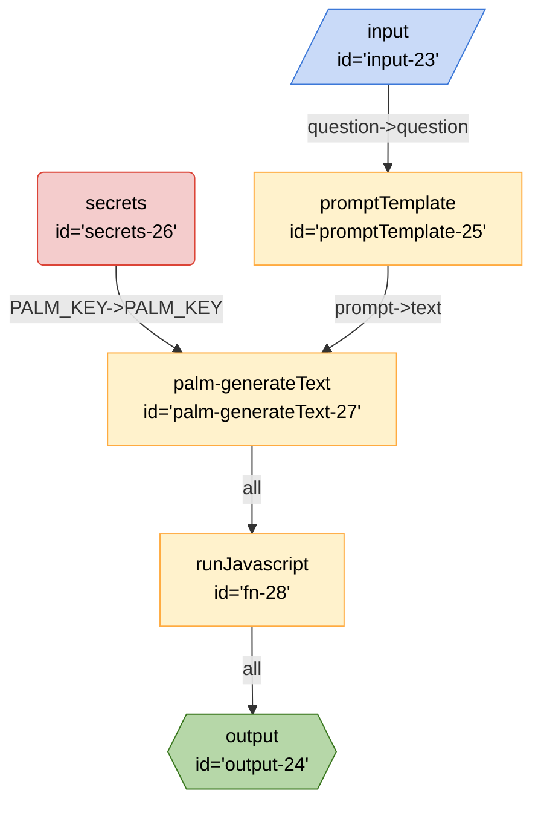

## if-else-serializable.ts

```mermaid
%%{init: 'themeVariables': { 'fontFamily': 'Fira Code, monospace' }}%%
graph TD;
fn28["runJavascript <br> id='fn-28'"] -- all --> output24{{"output <br> id='output-24'"}}:::output
palmgenerateText27["palm-generateText <br> id='palm-generateText-27'"] -- all --> fn28["runJavascript <br> id='fn-28'"]
secrets26("secrets <br> id='secrets-26'"):::secrets -- "PALM_KEY->PALM_KEY" --> palmgenerateText27["palm-generateText <br> id='palm-generateText-27'"]
promptTemplate25["promptTemplate <br> id='promptTemplate-25'"] -- "prompt->text" --> palmgenerateText27["palm-generateText <br> id='palm-generateText-27'"]
input23[/"input <br> id='input-23'"/]:::input -- "question->question" --> promptTemplate25["promptTemplate <br> id='promptTemplate-25'"]
classDef default stroke:#ffab40,fill:#fff2ccff,color:#000
classDef input stroke:#3c78d8,fill:#c9daf8ff,color:#000
classDef output stroke:#38761d,fill:#b6d7a8ff,color:#000
classDef passthrough stroke:#a64d79,fill:#ead1dcff,color:#000
classDef slot stroke:#a64d79,fill:#ead1dcff,color:#000
classDef config stroke:#a64d79,fill:#ead1dcff,color:#000
classDef secrets stroke:#db4437,fill:#f4cccc,color:#000
classDef slotted stroke:#a64d79
```