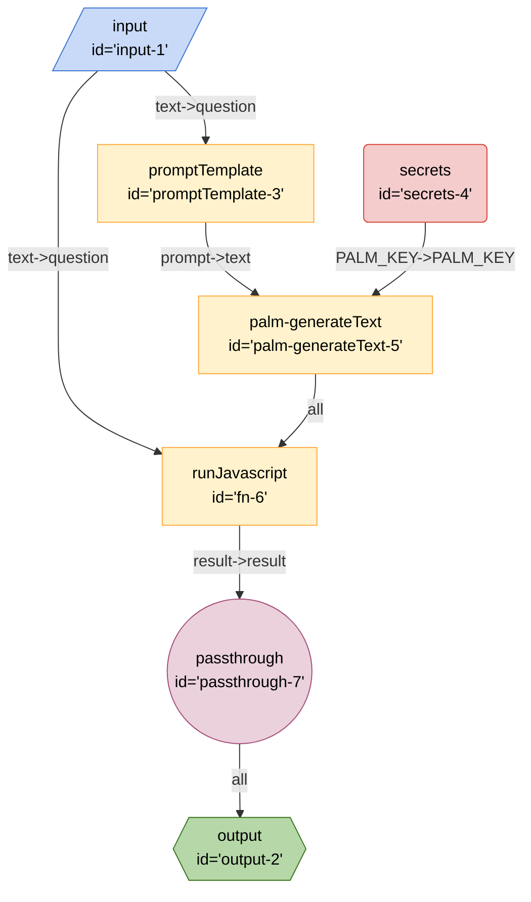

## if-else-serializable.ts

```mermaid
%%{init: 'themeVariables': { 'fontFamily': 'Fira Code, monospace' }}%%
graph TD;
passthrough7(("passthrough <br> id='passthrough-7'")):::passthrough -- all --> output2{{"output <br> id='output-2'"}}:::output
fn6["runJavascript <br> id='fn-6'"] -- "result->result" --> passthrough7(("passthrough <br> id='passthrough-7'")):::passthrough
input1[/"input <br> id='input-1'"/]:::input -- "text->question" --> promptTemplate3["promptTemplate <br> id='promptTemplate-3'"]
input1[/"input <br> id='input-1'"/]:::input -- "text->question" --> fn6["runJavascript <br> id='fn-6'"]
palmgenerateText5["palm-generateText <br> id='palm-generateText-5'"] -- all --> fn6["runJavascript <br> id='fn-6'"]
promptTemplate3["promptTemplate <br> id='promptTemplate-3'"] -- "prompt->text" --> palmgenerateText5["palm-generateText <br> id='palm-generateText-5'"]
secrets4("secrets <br> id='secrets-4'"):::secrets -- "PALM_KEY->PALM_KEY" --> palmgenerateText5["palm-generateText <br> id='palm-generateText-5'"]
classDef default stroke:#ffab40,fill:#fff2ccff,color:#000
classDef input stroke:#3c78d8,fill:#c9daf8ff,color:#000
classDef output stroke:#38761d,fill:#b6d7a8ff,color:#000
classDef passthrough stroke:#a64d79,fill:#ead1dcff,color:#000
classDef slot stroke:#a64d79,fill:#ead1dcff,color:#000
classDef config stroke:#a64d79,fill:#ead1dcff,color:#000
classDef secrets stroke:#db4437,fill:#f4cccc,color:#000
classDef slotted stroke:#a64d79
```