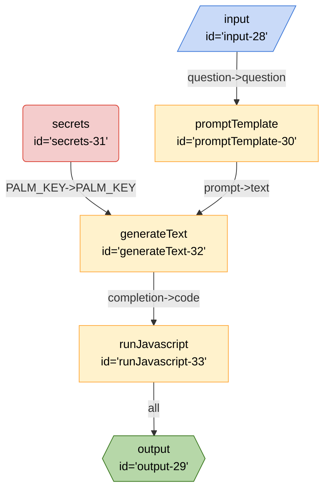

## math-chain.ts

```mermaid
%%{init: 'themeVariables': { 'fontFamily': 'Fira Code, monospace' }}%%
graph TD;
runJavascript33["runJavascript <br> id='runJavascript-33'"] -- all --> output29{{"output <br> id='output-29'"}}:::output
generateText32["generateText <br> id='generateText-32'"] -- "completion->code" --> runJavascript33["runJavascript <br> id='runJavascript-33'"]
secrets31("secrets <br> id='secrets-31'"):::secrets -- "PALM_KEY->PALM_KEY" --> generateText32["generateText <br> id='generateText-32'"]
promptTemplate30["promptTemplate <br> id='promptTemplate-30'"] -- "prompt->text" --> generateText32["generateText <br> id='generateText-32'"]
input28[/"input <br> id='input-28'"/]:::input -- "question->question" --> promptTemplate30["promptTemplate <br> id='promptTemplate-30'"]
classDef default stroke:#ffab40,fill:#fff2ccff,color:#000
classDef input stroke:#3c78d8,fill:#c9daf8ff,color:#000
classDef output stroke:#38761d,fill:#b6d7a8ff,color:#000
classDef passthrough stroke:#a64d79,fill:#ead1dcff,color:#000
classDef slot stroke:#a64d79,fill:#ead1dcff,color:#000
classDef config stroke:#a64d79,fill:#ead1dcff,color:#000
classDef secrets stroke:#db4437,fill:#f4cccc,color:#000
classDef slotted stroke:#a64d79
```