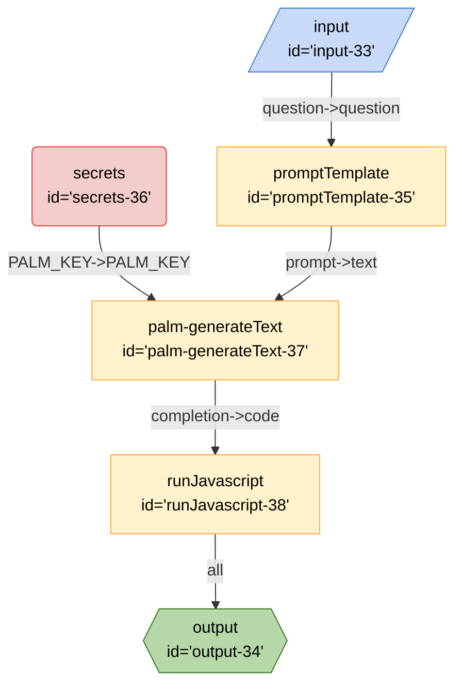

## math-chain.ts

```mermaid
%%{init: 'themeVariables': { 'fontFamily': 'Fira Code, monospace' }}%%
graph TD;
runJavascript38["runJavascript <br> id='runJavascript-38'"] -- all --> output34{{"output <br> id='output-34'"}}:::output
palmgenerateText37["palm-generateText <br> id='palm-generateText-37'"] -- "completion->code" --> runJavascript38["runJavascript <br> id='runJavascript-38'"]
secrets36("secrets <br> id='secrets-36'"):::secrets -- "PALM_KEY->PALM_KEY" --> palmgenerateText37["palm-generateText <br> id='palm-generateText-37'"]
promptTemplate35["promptTemplate <br> id='promptTemplate-35'"] -- "prompt->text" --> palmgenerateText37["palm-generateText <br> id='palm-generateText-37'"]
input33[/"input <br> id='input-33'"/]:::input -- "question->question" --> promptTemplate35["promptTemplate <br> id='promptTemplate-35'"]
classDef default stroke:#ffab40,fill:#fff2ccff,color:#000
classDef input stroke:#3c78d8,fill:#c9daf8ff,color:#000
classDef output stroke:#38761d,fill:#b6d7a8ff,color:#000
classDef passthrough stroke:#a64d79,fill:#ead1dcff,color:#000
classDef slot stroke:#a64d79,fill:#ead1dcff,color:#000
classDef config stroke:#a64d79,fill:#ead1dcff,color:#000
classDef secrets stroke:#db4437,fill:#f4cccc,color:#000
classDef slotted stroke:#a64d79
```