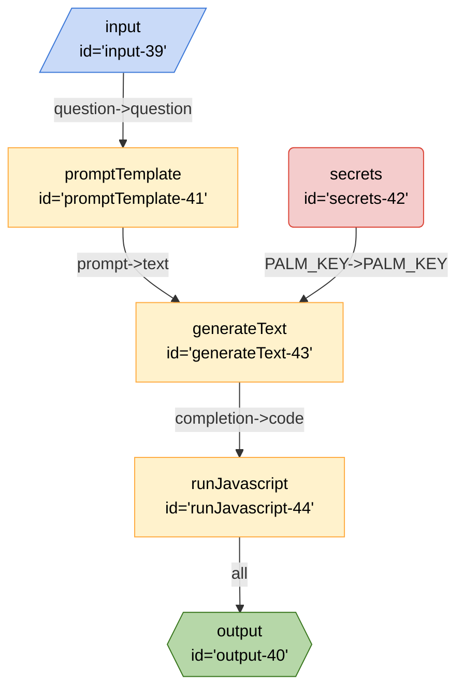

## math-imperative.ts

```mermaid
%%{init: 'themeVariables': { 'fontFamily': 'Fira Code, monospace' }}%%
graph TD;
runJavascript44["runJavascript <br> id='runJavascript-44'"] -- all --> output40{{"output <br> id='output-40'"}}:::output
generateText43["generateText <br> id='generateText-43'"] -- "completion->code" --> runJavascript44["runJavascript <br> id='runJavascript-44'"]
promptTemplate41["promptTemplate <br> id='promptTemplate-41'"] -- "prompt->text" --> generateText43["generateText <br> id='generateText-43'"]
secrets42("secrets <br> id='secrets-42'"):::secrets -- "PALM_KEY->PALM_KEY" --> generateText43["generateText <br> id='generateText-43'"]
input39[/"input <br> id='input-39'"/]:::input -- "question->question" --> promptTemplate41["promptTemplate <br> id='promptTemplate-41'"]
classDef default stroke:#ffab40,fill:#fff2ccff,color:#000
classDef input stroke:#3c78d8,fill:#c9daf8ff,color:#000
classDef output stroke:#38761d,fill:#b6d7a8ff,color:#000
classDef passthrough stroke:#a64d79,fill:#ead1dcff,color:#000
classDef slot stroke:#a64d79,fill:#ead1dcff,color:#000
classDef config stroke:#a64d79,fill:#ead1dcff,color:#000
classDef secrets stroke:#db4437,fill:#f4cccc,color:#000
classDef slotted stroke:#a64d79
```