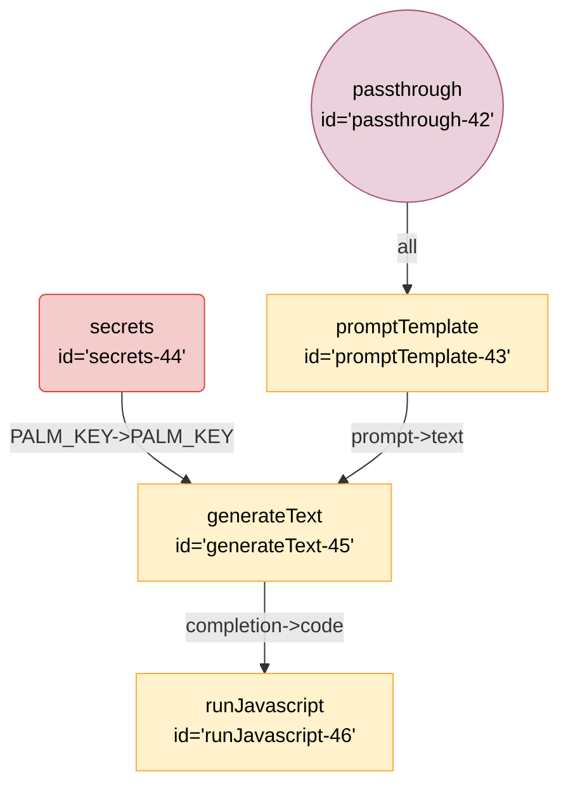

## math-inline-chain.ts

```mermaid
%%{init: 'themeVariables': { 'fontFamily': 'Fira Code, monospace' }}%%
graph TD;
generateText45["generateText <br> id='generateText-45'"] -- "completion->code" --> runJavascript46["runJavascript <br> id='runJavascript-46'"]
secrets44("secrets <br> id='secrets-44'"):::secrets -- "PALM_KEY->PALM_KEY" --> generateText45["generateText <br> id='generateText-45'"]
promptTemplate43["promptTemplate <br> id='promptTemplate-43'"] -- "prompt->text" --> generateText45["generateText <br> id='generateText-45'"]
passthrough42(("passthrough <br> id='passthrough-42'")):::passthrough -- all --> promptTemplate43["promptTemplate <br> id='promptTemplate-43'"]
classDef default stroke:#ffab40,fill:#fff2ccff,color:#000
classDef input stroke:#3c78d8,fill:#c9daf8ff,color:#000
classDef output stroke:#38761d,fill:#b6d7a8ff,color:#000
classDef passthrough stroke:#a64d79,fill:#ead1dcff,color:#000
classDef slot stroke:#a64d79,fill:#ead1dcff,color:#000
classDef config stroke:#a64d79,fill:#ead1dcff,color:#000
classDef secrets stroke:#db4437,fill:#f4cccc,color:#000
classDef slotted stroke:#a64d79
```