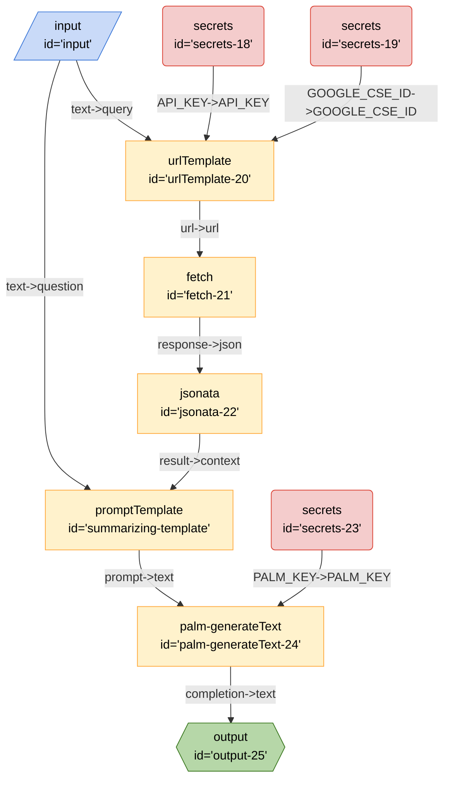

## search-summarize.ts

```mermaid
%%{init: 'themeVariables': { 'fontFamily': 'Fira Code, monospace' }}%%
graph TD;
palmgenerateText24["palm-generateText <br> id='palm-generateText-24'"] -- "completion->text" --> output25{{"output <br> id='output-25'"}}:::output
summarizingtemplate["promptTemplate <br> id='summarizing-template'"] -- "prompt->text" --> palmgenerateText24["palm-generateText <br> id='palm-generateText-24'"]
secrets23("secrets <br> id='secrets-23'"):::secrets -- "PALM_KEY->PALM_KEY" --> palmgenerateText24["palm-generateText <br> id='palm-generateText-24'"]
input[/"input <br> id='input'"/]:::input -- "text->query" --> urlTemplate20["urlTemplate <br> id='urlTemplate-20'"]
input[/"input <br> id='input'"/]:::input -- "text->question" --> summarizingtemplate["promptTemplate <br> id='summarizing-template'"]
jsonata22["jsonata <br> id='jsonata-22'"] -- "result->context" --> summarizingtemplate["promptTemplate <br> id='summarizing-template'"]
urlTemplate20["urlTemplate <br> id='urlTemplate-20'"] -- "url->url" --> fetch21["fetch <br> id='fetch-21'"]
fetch21["fetch <br> id='fetch-21'"] -- "response->json" --> jsonata22["jsonata <br> id='jsonata-22'"]
secrets18("secrets <br> id='secrets-18'"):::secrets -- "API_KEY->API_KEY" --> urlTemplate20["urlTemplate <br> id='urlTemplate-20'"]
secrets19("secrets <br> id='secrets-19'"):::secrets -- "GOOGLE_CSE_ID->GOOGLE_CSE_ID" --> urlTemplate20["urlTemplate <br> id='urlTemplate-20'"]
classDef default stroke:#ffab40,fill:#fff2ccff,color:#000
classDef input stroke:#3c78d8,fill:#c9daf8ff,color:#000
classDef output stroke:#38761d,fill:#b6d7a8ff,color:#000
classDef passthrough stroke:#a64d79,fill:#ead1dcff,color:#000
classDef slot stroke:#a64d79,fill:#ead1dcff,color:#000
classDef config stroke:#a64d79,fill:#ead1dcff,color:#000
classDef secrets stroke:#db4437,fill:#f4cccc,color:#000
classDef slotted stroke:#a64d79
```