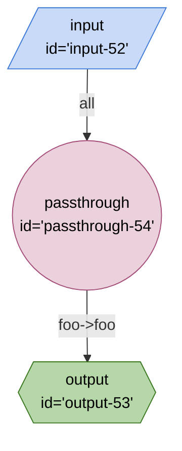

## simple-graph.ts

```mermaid
%%{init: 'themeVariables': { 'fontFamily': 'Fira Code, monospace' }}%%
graph TD;
passthrough54(("passthrough <br> id='passthrough-54'")):::passthrough -- "foo->foo" --> output53{{"output <br> id='output-53'"}}:::output
input52[/"input <br> id='input-52'"/]:::input -- all --> passthrough54(("passthrough <br> id='passthrough-54'")):::passthrough
classDef default stroke:#ffab40,fill:#fff2ccff,color:#000
classDef input stroke:#3c78d8,fill:#c9daf8ff,color:#000
classDef output stroke:#38761d,fill:#b6d7a8ff,color:#000
classDef passthrough stroke:#a64d79,fill:#ead1dcff,color:#000
classDef slot stroke:#a64d79,fill:#ead1dcff,color:#000
classDef config stroke:#a64d79,fill:#ead1dcff,color:#000
classDef secrets stroke:#db4437,fill:#f4cccc,color:#000
classDef slotted stroke:#a64d79
```