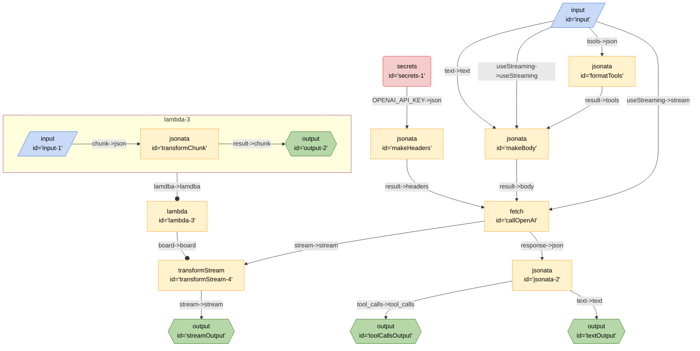

## openai-gpt-35-turbo.ts

```mermaid
%%{init: 'themeVariables': { 'fontFamily': 'Fira Code, monospace' }}%%
graph TD;
secrets1("secrets <br> id='secrets-1'"):::secrets -- "OPENAI_API_KEY->json" --> makeHeaders["jsonata <br> id='makeHeaders'"]
input[/"input <br> id='input'"/]:::input -- "useStreaming->stream" --> callOpenAI["fetch <br> id='callOpenAI'"]
makeHeaders["jsonata <br> id='makeHeaders'"] -- "result->headers" --> callOpenAI["fetch <br> id='callOpenAI'"]
lambda3["lambda <br> id='lambda-3'"] -- "board->board" --o transformStream4["transformStream <br> id='transformStream-4'"]
subgraph sg_lambda3 [lambda-3]
lambda3_transformChunk["jsonata <br> id='transformChunk'"] -- "result->chunk" --> lambda3_output2{{"output <br> id='output-2'"}}:::output
lambda3_input1[/"input <br> id='input-1'"/]:::input -- "chunk->json" --> lambda3_transformChunk["jsonata <br> id='transformChunk'"]
end
sg_lambda3:::slotted -- "lamdba->lamdba" --o lambda3

formatTools["jsonata <br> id='formatTools'"] -- "result->tools" --> makeBody["jsonata <br> id='makeBody'"]
input[/"input <br> id='input'"/]:::input -- "tools->json" --> formatTools["jsonata <br> id='formatTools'"]
input[/"input <br> id='input'"/]:::input -- "useStreaming->useStreaming" --> makeBody["jsonata <br> id='makeBody'"]
jsonata2["jsonata <br> id='jsonata-2'"] -- "text->text" --> textOutput{{"output <br> id='textOutput'"}}:::output
jsonata2["jsonata <br> id='jsonata-2'"] -- "tool_calls->tool_calls" --> toolCallsOutput{{"output <br> id='toolCallsOutput'"}}:::output
callOpenAI["fetch <br> id='callOpenAI'"] -- "response->json" --> jsonata2["jsonata <br> id='jsonata-2'"]
transformStream4["transformStream <br> id='transformStream-4'"] -- "stream->stream" --> streamOutput{{"output <br> id='streamOutput'"}}:::output
callOpenAI["fetch <br> id='callOpenAI'"] -- "stream->stream" --> transformStream4["transformStream <br> id='transformStream-4'"]
makeBody["jsonata <br> id='makeBody'"] -- "result->body" --> callOpenAI["fetch <br> id='callOpenAI'"]
input[/"input <br> id='input'"/]:::input -- "text->text" --> makeBody["jsonata <br> id='makeBody'"]
classDef default stroke:#ffab40,fill:#fff2ccff,color:#000
classDef input stroke:#3c78d8,fill:#c9daf8ff,color:#000
classDef output stroke:#38761d,fill:#b6d7a8ff,color:#000
classDef passthrough stroke:#a64d79,fill:#ead1dcff,color:#000
classDef slot stroke:#a64d79,fill:#ead1dcff,color:#000
classDef config stroke:#a64d79,fill:#ead1dcff,color:#000
classDef secrets stroke:#db4437,fill:#f4cccc,color:#000
classDef slotted stroke:#a64d79
```