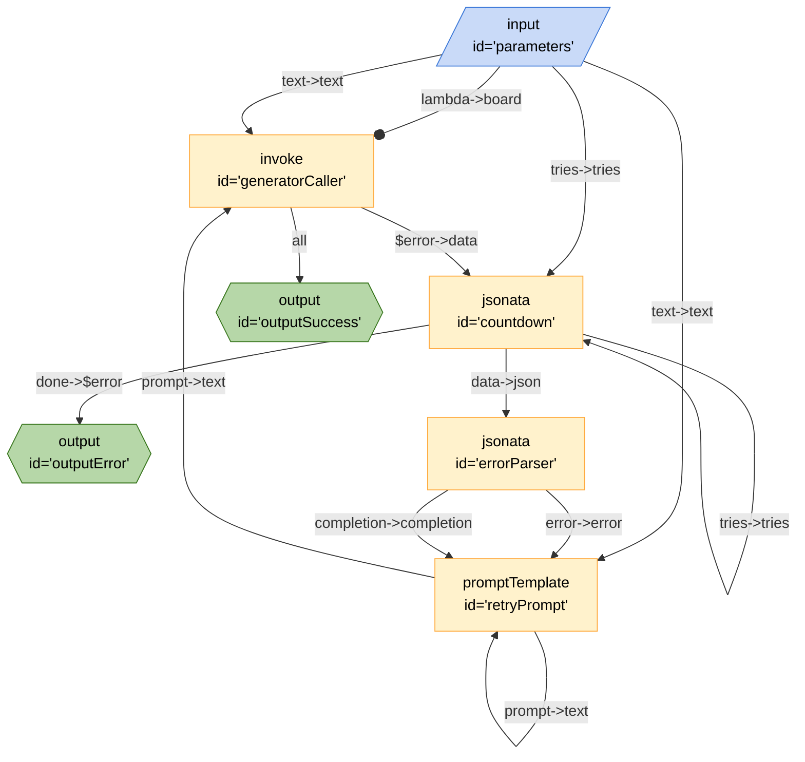

## retry.ts

```mermaid
%%{init: 'themeVariables': { 'fontFamily': 'Fira Code, monospace' }}%%
graph TD;
parameters[/"input <br> id='parameters'"/]:::input -- "lambda->board" --o generatorCaller["invoke <br> id='generatorCaller'"]
parameters[/"input <br> id='parameters'"/]:::input -- "tries->tries" --> countdown["jsonata <br> id='countdown'"]
countdown["jsonata <br> id='countdown'"] -- "tries->tries" --> countdown["jsonata <br> id='countdown'"]
parameters[/"input <br> id='parameters'"/]:::input -- "text->text" --> retryPrompt["promptTemplate <br> id='retryPrompt'"]
retryPrompt["promptTemplate <br> id='retryPrompt'"] -- "prompt->text" --> retryPrompt["promptTemplate <br> id='retryPrompt'"]
parameters[/"input <br> id='parameters'"/]:::input -- "text->text" --> generatorCaller["invoke <br> id='generatorCaller'"]
generatorCaller["invoke <br> id='generatorCaller'"] -- all --> outputSuccess{{"output <br> id='outputSuccess'"}}:::output
generatorCaller["invoke <br> id='generatorCaller'"] -- "$error->data" --> countdown["jsonata <br> id='countdown'"]
countdown["jsonata <br> id='countdown'"] -- "done->$error" --> outputError{{"output <br> id='outputError'"}}:::output
countdown["jsonata <br> id='countdown'"] -- "data->json" --> errorParser["jsonata <br> id='errorParser'"]
errorParser["jsonata <br> id='errorParser'"] -- "error->error" --> retryPrompt["promptTemplate <br> id='retryPrompt'"]
errorParser["jsonata <br> id='errorParser'"] -- "completion->completion" --> retryPrompt["promptTemplate <br> id='retryPrompt'"]
retryPrompt["promptTemplate <br> id='retryPrompt'"] -- "prompt->text" --> generatorCaller["invoke <br> id='generatorCaller'"]
classDef default stroke:#ffab40,fill:#fff2ccff,color:#000
classDef input stroke:#3c78d8,fill:#c9daf8ff,color:#000
classDef output stroke:#38761d,fill:#b6d7a8ff,color:#000
classDef passthrough stroke:#a64d79,fill:#ead1dcff,color:#000
classDef slot stroke:#a64d79,fill:#ead1dcff,color:#000
classDef config stroke:#a64d79,fill:#ead1dcff,color:#000
classDef secrets stroke:#db4437,fill:#f4cccc,color:#000
classDef slotted stroke:#a64d79
```