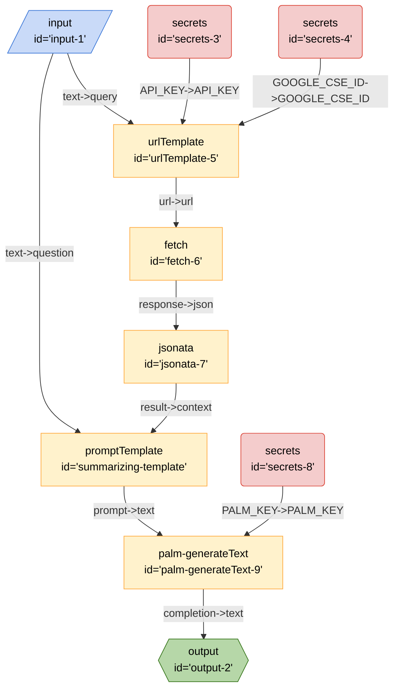

## search-summarize-as-recipe.ts

```mermaid
%%{init: 'themeVariables': { 'fontFamily': 'Fira Code, monospace' }}%%
graph TD;
palmgenerateText9["palm-generateText <br> id='palm-generateText-9'"] -- "completion->text" --> output2{{"output <br> id='output-2'"}}:::output
summarizingtemplate["promptTemplate <br> id='summarizing-template'"] -- "prompt->text" --> palmgenerateText9["palm-generateText <br> id='palm-generateText-9'"]
secrets8("secrets <br> id='secrets-8'"):::secrets -- "PALM_KEY->PALM_KEY" --> palmgenerateText9["palm-generateText <br> id='palm-generateText-9'"]
input1[/"input <br> id='input-1'"/]:::input -- "text->query" --> urlTemplate5["urlTemplate <br> id='urlTemplate-5'"]
input1[/"input <br> id='input-1'"/]:::input -- "text->question" --> summarizingtemplate["promptTemplate <br> id='summarizing-template'"]
jsonata7["jsonata <br> id='jsonata-7'"] -- "result->context" --> summarizingtemplate["promptTemplate <br> id='summarizing-template'"]
urlTemplate5["urlTemplate <br> id='urlTemplate-5'"] -- "url->url" --> fetch6["fetch <br> id='fetch-6'"]
fetch6["fetch <br> id='fetch-6'"] -- "response->json" --> jsonata7["jsonata <br> id='jsonata-7'"]
secrets3("secrets <br> id='secrets-3'"):::secrets -- "API_KEY->API_KEY" --> urlTemplate5["urlTemplate <br> id='urlTemplate-5'"]
secrets4("secrets <br> id='secrets-4'"):::secrets -- "GOOGLE_CSE_ID->GOOGLE_CSE_ID" --> urlTemplate5["urlTemplate <br> id='urlTemplate-5'"]
classDef default stroke:#ffab40,fill:#fff2ccff,color:#000
classDef input stroke:#3c78d8,fill:#c9daf8ff,color:#000
classDef output stroke:#38761d,fill:#b6d7a8ff,color:#000
classDef passthrough stroke:#a64d79,fill:#ead1dcff,color:#000
classDef slot stroke:#a64d79,fill:#ead1dcff,color:#000
classDef config stroke:#a64d79,fill:#ead1dcff,color:#000
classDef secrets stroke:#db4437,fill:#f4cccc,color:#000
classDef slotted stroke:#a64d79
```