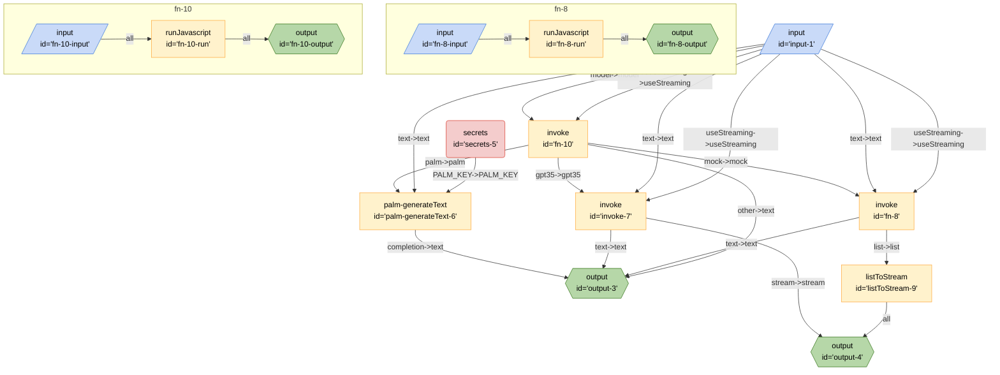

## text-generator-recipe.ts

```mermaid
%%{init: 'themeVariables': { 'fontFamily': 'Fira Code, monospace' }}%%
graph TD;
palmgenerateText6["palm-generateText <br> id='palm-generateText-6'"] -- "completion->text" --> output3{{"output <br> id='output-3'"}}:::output
invoke7["invoke <br> id='invoke-7'"] -- "text->text" --> output3{{"output <br> id='output-3'"}}:::output
invoke7["invoke <br> id='invoke-7'"] -- "stream->stream" --> output4{{"output <br> id='output-4'"}}:::output
fn8["invoke <br> id='fn-8'"] -- "text->text" --> output3{{"output <br> id='output-3'"}}:::output
fn8["invoke <br> id='fn-8'"] -- "list->list" --> listToStream9["listToStream <br> id='listToStream-9'"]
fn10["invoke <br> id='fn-10'"] -- "palm->palm" --> palmgenerateText6["palm-generateText <br> id='palm-generateText-6'"]
fn10["invoke <br> id='fn-10'"] -- "gpt35->gpt35" --> invoke7["invoke <br> id='invoke-7'"]
fn10["invoke <br> id='fn-10'"] -- "mock->mock" --> fn8["invoke <br> id='fn-8'"]
fn10["invoke <br> id='fn-10'"] -- "other->text" --> output3{{"output <br> id='output-3'"}}:::output
input1[/"input <br> id='input-1'"/]:::input -- "text->text" --> palmgenerateText6["palm-generateText <br> id='palm-generateText-6'"]
input1[/"input <br> id='input-1'"/]:::input -- "text->text" --> invoke7["invoke <br> id='invoke-7'"]
input1[/"input <br> id='input-1'"/]:::input -- "useStreaming->useStreaming" --> invoke7["invoke <br> id='invoke-7'"]
input1[/"input <br> id='input-1'"/]:::input -- "text->text" --> fn8["invoke <br> id='fn-8'"]
input1[/"input <br> id='input-1'"/]:::input -- "useStreaming->useStreaming" --> fn8["invoke <br> id='fn-8'"]
input1[/"input <br> id='input-1'"/]:::input -- "model->model" --> fn10["invoke <br> id='fn-10'"]
input1[/"input <br> id='input-1'"/]:::input -- "useStreaming->useStreaming" --> fn10["invoke <br> id='fn-10'"]
secrets5("secrets <br> id='secrets-5'"):::secrets -- "PALM_KEY->PALM_KEY" --> palmgenerateText6["palm-generateText <br> id='palm-generateText-6'"]
listToStream9["listToStream <br> id='listToStream-9'"] -- all --> output4{{"output <br> id='output-4'"}}:::output

subgraph sg_fn8 [fn-8]
fn8_fn8input[/"input <br> id='fn-8-input'"/]:::input -- all --> fn8_fn8run["runJavascript <br> id='fn-8-run'"]
fn8_fn8run["runJavascript <br> id='fn-8-run'"] -- all --> fn8_fn8output{{"output <br> id='fn-8-output'"}}:::output
end


subgraph sg_fn10 [fn-10]
fn10_fn10input[/"input <br> id='fn-10-input'"/]:::input -- all --> fn10_fn10run["runJavascript <br> id='fn-10-run'"]
fn10_fn10run["runJavascript <br> id='fn-10-run'"] -- all --> fn10_fn10output{{"output <br> id='fn-10-output'"}}:::output
end

classDef default stroke:#ffab40,fill:#fff2ccff,color:#000
classDef input stroke:#3c78d8,fill:#c9daf8ff,color:#000
classDef output stroke:#38761d,fill:#b6d7a8ff,color:#000
classDef passthrough stroke:#a64d79,fill:#ead1dcff,color:#000
classDef slot stroke:#a64d79,fill:#ead1dcff,color:#000
classDef config stroke:#a64d79,fill:#ead1dcff,color:#000
classDef secrets stroke:#db4437,fill:#f4cccc,color:#000
classDef slotted stroke:#a64d79
```