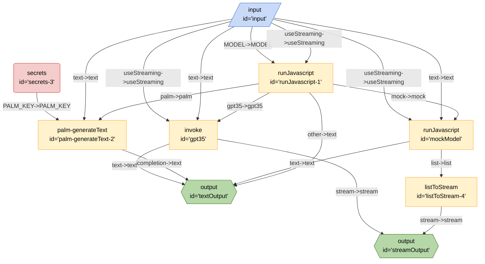

## text-generator.ts

```mermaid
%%{init: 'themeVariables': { 'fontFamily': 'Fira Code, monospace' }}%%
graph TD;
secrets3("secrets <br> id='secrets-3'"):::secrets -- "PALM_KEY->PALM_KEY" --> palmgenerateText2["palm-generateText <br> id='palm-generateText-2'"]
input[/"input <br> id='input'"/]:::input -- "MODEL->MODEL" --> runJavascript1["runJavascript <br> id='runJavascript-1'"]
input[/"input <br> id='input'"/]:::input -- "useStreaming->useStreaming" --> runJavascript1["runJavascript <br> id='runJavascript-1'"]
input[/"input <br> id='input'"/]:::input -- "useStreaming->useStreaming" --> gpt35["invoke <br> id='gpt35'"]
gpt35["invoke <br> id='gpt35'"] -- "text->text" --> textOutput{{"output <br> id='textOutput'"}}:::output
input[/"input <br> id='input'"/]:::input -- "text->text" --> gpt35["invoke <br> id='gpt35'"]
gpt35["invoke <br> id='gpt35'"] -- "stream->stream" --> streamOutput{{"output <br> id='streamOutput'"}}:::output
palmgenerateText2["palm-generateText <br> id='palm-generateText-2'"] -- "completion->text" --> textOutput{{"output <br> id='textOutput'"}}:::output
input[/"input <br> id='input'"/]:::input -- "text->text" --> palmgenerateText2["palm-generateText <br> id='palm-generateText-2'"]
input[/"input <br> id='input'"/]:::input -- "useStreaming->useStreaming" --> mockModel["runJavascript <br> id='mockModel'"]
mockModel["runJavascript <br> id='mockModel'"] -- "text->text" --> textOutput{{"output <br> id='textOutput'"}}:::output
input[/"input <br> id='input'"/]:::input -- "text->text" --> mockModel["runJavascript <br> id='mockModel'"]
runJavascript1["runJavascript <br> id='runJavascript-1'"] -- "other->text" --> textOutput{{"output <br> id='textOutput'"}}:::output
runJavascript1["runJavascript <br> id='runJavascript-1'"] -- "palm->palm" --> palmgenerateText2["palm-generateText <br> id='palm-generateText-2'"]
runJavascript1["runJavascript <br> id='runJavascript-1'"] -- "gpt35->gpt35" --> gpt35["invoke <br> id='gpt35'"]
runJavascript1["runJavascript <br> id='runJavascript-1'"] -- "mock->mock" --> mockModel["runJavascript <br> id='mockModel'"]
mockModel["runJavascript <br> id='mockModel'"] -- "list->list" --> listToStream4["listToStream <br> id='listToStream-4'"]
listToStream4["listToStream <br> id='listToStream-4'"] -- "stream->stream" --> streamOutput{{"output <br> id='streamOutput'"}}:::output
classDef default stroke:#ffab40,fill:#fff2ccff,color:#000
classDef input stroke:#3c78d8,fill:#c9daf8ff,color:#000
classDef output stroke:#38761d,fill:#b6d7a8ff,color:#000
classDef passthrough stroke:#a64d79,fill:#ead1dcff,color:#000
classDef slot stroke:#a64d79,fill:#ead1dcff,color:#000
classDef config stroke:#a64d79,fill:#ead1dcff,color:#000
classDef secrets stroke:#db4437,fill:#f4cccc,color:#000
classDef slotted stroke:#a64d79
```