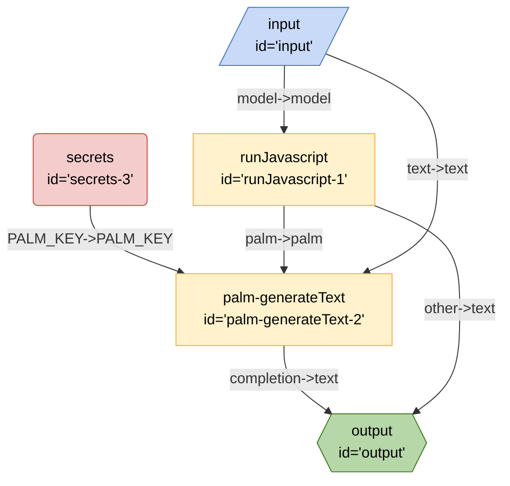

## text-generator.ts

```mermaid
%%{init: 'themeVariables': { 'fontFamily': 'Fira Code, monospace' }}%%
graph TD;
secrets3("secrets <br> id='secrets-3'"):::secrets -- "PALM_KEY->PALM_KEY" --> palmgenerateText2["palm-generateText <br> id='palm-generateText-2'"]
runJavascript1["runJavascript <br> id='runJavascript-1'"] -- "palm->palm" --> palmgenerateText2["palm-generateText <br> id='palm-generateText-2'"]
input[/"input <br> id='input'"/]:::input -- "model->model" --> runJavascript1["runJavascript <br> id='runJavascript-1'"]
palmgenerateText2["palm-generateText <br> id='palm-generateText-2'"] -- "completion->text" --> output{{"output <br> id='output'"}}:::output
input[/"input <br> id='input'"/]:::input -- "text->text" --> palmgenerateText2["palm-generateText <br> id='palm-generateText-2'"]
runJavascript1["runJavascript <br> id='runJavascript-1'"] -- "other->text" --> output{{"output <br> id='output'"}}:::output
classDef default stroke:#ffab40,fill:#fff2ccff,color:#000
classDef input stroke:#3c78d8,fill:#c9daf8ff,color:#000
classDef output stroke:#38761d,fill:#b6d7a8ff,color:#000
classDef passthrough stroke:#a64d79,fill:#ead1dcff,color:#000
classDef slot stroke:#a64d79,fill:#ead1dcff,color:#000
classDef config stroke:#a64d79,fill:#ead1dcff,color:#000
classDef secrets stroke:#db4437,fill:#f4cccc,color:#000
classDef slotted stroke:#a64d79
```