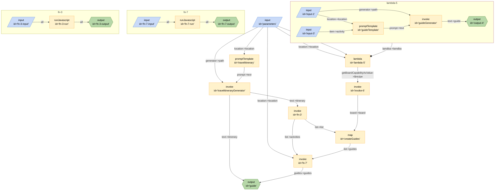

## tour-guide-writer-3.ts

```mermaid
%%{init: 'themeVariables': { 'fontFamily': 'Fira Code, monospace' }}%%
graph TD;
travelItineraryGenerator["invoke <br> id='travelItineraryGenerator'"] -- "text->itinerary" --> guide{{"output <br> id='guide'"}}:::output
travelItineraryGenerator["invoke <br> id='travelItineraryGenerator'"] -- "text->itinerary" --> fn3["invoke <br> id='fn-3'"]
fn7["invoke <br> id='fn-7'"] -- "guides->guides" --> guide{{"output <br> id='guide'"}}:::output
parameters[/"input <br> id='parameters'"/]:::input -- "location->location" --> travelItinerary["promptTemplate <br> id='travelItinerary'"]
parameters[/"input <br> id='parameters'"/]:::input -- "generator->path" --> travelItineraryGenerator["invoke <br> id='travelItineraryGenerator'"]
parameters[/"input <br> id='parameters'"/]:::input -- "location->location" --> lambda5["lambda <br> id='lambda-5'"]
parameters[/"input <br> id='parameters'"/]:::input -- "generator->generator" --> lambda5["lambda <br> id='lambda-5'"]
parameters[/"input <br> id='parameters'"/]:::input -- "location->location" --> fn7["invoke <br> id='fn-7'"]
travelItinerary["promptTemplate <br> id='travelItinerary'"] -- "prompt->text" --> travelItineraryGenerator["invoke <br> id='travelItineraryGenerator'"]
fn3["invoke <br> id='fn-3'"] -- "list->list" --> createGuides["map <br> id='createGuides'"]
fn3["invoke <br> id='fn-3'"] -- "list->activities" --> fn7["invoke <br> id='fn-7'"]
createGuides["map <br> id='createGuides'"] -- "list->guides" --> fn7["invoke <br> id='fn-7'"]
lambda5["lambda <br> id='lambda-5'"] -- "getBoardCapabilityAsValue->$recipe" --> invoke6["invoke <br> id='invoke-6'"]
subgraph sg_lambda5 [lambda-5]
lambda5_guideGenerator["invoke <br> id='guideGenerator'"] -- "text->guide" --> lambda5_output4{{"output <br> id='output-4'"}}:::output
lambda5_input1[/"input <br> id='input-1'"/]:::input -- "location->location" --> lambda5_guideTemplate["promptTemplate <br> id='guideTemplate'"]
lambda5_input1[/"input <br> id='input-1'"/]:::input -- "generator->path" --> lambda5_guideGenerator["invoke <br> id='guideGenerator'"]
lambda5_guideTemplate["promptTemplate <br> id='guideTemplate'"] -- "prompt->text" --> lambda5_guideGenerator["invoke <br> id='guideGenerator'"]
lambda5_input3[/"input <br> id='input-3'"/]:::input -- "item->activity" --> lambda5_guideTemplate["promptTemplate <br> id='guideTemplate'"]
end
sg_lambda5:::slotted -- "lamdba->lamdba" --o lambda5

invoke6["invoke <br> id='invoke-6'"] -- "board->board" --> createGuides["map <br> id='createGuides'"]

subgraph sg_fn7 [fn-7]
fn7_fn7input[/"input <br> id='fn-7-input'"/]:::input -- all --> fn7_fn7run["runJavascript <br> id='fn-7-run'"]
fn7_fn7run["runJavascript <br> id='fn-7-run'"] -- all --> fn7_fn7output{{"output <br> id='fn-7-output'"}}:::output
end


subgraph sg_fn3 [fn-3]
fn3_fn3input[/"input <br> id='fn-3-input'"/]:::input -- all --> fn3_fn3run["runJavascript <br> id='fn-3-run'"]
fn3_fn3run["runJavascript <br> id='fn-3-run'"] -- all --> fn3_fn3output{{"output <br> id='fn-3-output'"}}:::output
end

classDef default stroke:#ffab40,fill:#fff2ccff,color:#000
classDef input stroke:#3c78d8,fill:#c9daf8ff,color:#000
classDef output stroke:#38761d,fill:#b6d7a8ff,color:#000
classDef passthrough stroke:#a64d79,fill:#ead1dcff,color:#000
classDef slot stroke:#a64d79,fill:#ead1dcff,color:#000
classDef config stroke:#a64d79,fill:#ead1dcff,color:#000
classDef secrets stroke:#db4437,fill:#f4cccc,color:#000
classDef slotted stroke:#a64d79
```