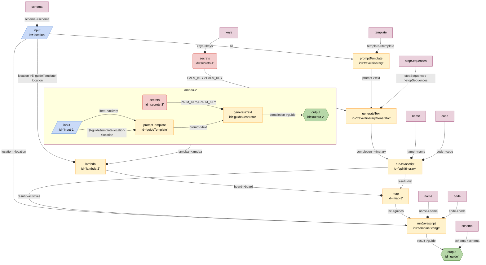

## tour-guide-writer.ts

```mermaid
%%{init: 'themeVariables': { 'fontFamily': 'Fira Code, monospace' }}%%
graph TD;
secrets1("secrets <br> id='secrets-1'"):::secrets -- "PALM_KEY->PALM_KEY" --> travelItineraryGenerator["generateText <br> id='travelItineraryGenerator'"]
location[/"input <br> id='location'"/]:::input -- "location->$l-guideTemplate-location" --o lambda2["lambda <br> id='lambda-2'"]
lambda2["lambda <br> id='lambda-2'"] -- "board->board" --o map3["map <br> id='map-3'"]
subgraph sg_lambda2 [lambda-2]
lambda2_secrets3("secrets <br> id='secrets-3'"):::secrets -- "PALM_KEY->PALM_KEY" --o lambda2_guideGenerator["generateText <br> id='guideGenerator'"]
lambda2_guideGenerator["generateText <br> id='guideGenerator'"] -- "completion->guide" --> lambda2_output2{{"output <br> id='output-2'"}}:::output
lambda2_guideTemplate["promptTemplate <br> id='guideTemplate'"] -- "prompt->text" --> lambda2_guideGenerator["generateText <br> id='guideGenerator'"]
lambda2_input1[/"input <br> id='input-1'"/]:::input -- "item->activity" --> lambda2_guideTemplate["promptTemplate <br> id='guideTemplate'"]
lambda2_input1[/"input <br> id='input-1'"/]:::input -- "$l-guideTemplate-location->location" --o lambda2_guideTemplate["promptTemplate <br> id='guideTemplate'"]


end
sg_lambda2:::slotted -- "lamdba->lamdba" --o lambda2

combineStrings["runJavascript <br> id='combineStrings'"] -- "result->guide" --> guide{{"output <br> id='guide'"}}:::output
location[/"input <br> id='location'"/]:::input -- "location->location" --> combineStrings["runJavascript <br> id='combineStrings'"]
splitItinerary["runJavascript <br> id='splitItinerary'"] -- "result->activities" --> combineStrings["runJavascript <br> id='combineStrings'"]
map3["map <br> id='map-3'"] -- "list->guides" --> combineStrings["runJavascript <br> id='combineStrings'"]
splitItinerary["runJavascript <br> id='splitItinerary'"] -- "result->list" --> map3["map <br> id='map-3'"]
travelItineraryGenerator["generateText <br> id='travelItineraryGenerator'"] -- "completion->itinerary" --> splitItinerary["runJavascript <br> id='splitItinerary'"]
travelItinerary["promptTemplate <br> id='travelItinerary'"] -- "prompt->text" --> travelItineraryGenerator["generateText <br> id='travelItineraryGenerator'"]
location[/"input <br> id='location'"/]:::input -- all --> travelItinerary["promptTemplate <br> id='travelItinerary'"]
schemalocation[schema]:::config -- "schema->schema" --o location
schemaguide[schema]:::config -- "schema->schema" --o guide
templatetravelItinerary[template]:::config -- "template->template" --o travelItinerary
stopSequencestravelItineraryGenerator[stopSequences]:::config -- "stopSequences->stopSequences" --o travelItineraryGenerator
keyssecrets1[keys]:::config -- "keys->keys" --o secrets1
namesplitItinerary[name]:::config -- "name->name" --o splitItinerary
codesplitItinerary[code]:::config -- "code->code" --o splitItinerary

namecombineStrings[name]:::config -- "name->name" --o combineStrings
codecombineStrings[code]:::config -- "code->code" --o combineStrings
classDef default stroke:#ffab40,fill:#fff2ccff,color:#000
classDef input stroke:#3c78d8,fill:#c9daf8ff,color:#000
classDef output stroke:#38761d,fill:#b6d7a8ff,color:#000
classDef passthrough stroke:#a64d79,fill:#ead1dcff,color:#000
classDef slot stroke:#a64d79,fill:#ead1dcff,color:#000
classDef config stroke:#a64d79,fill:#ead1dcff,color:#000
classDef secrets stroke:#db4437,fill:#f4cccc,color:#000
classDef slotted stroke:#a64d79
```