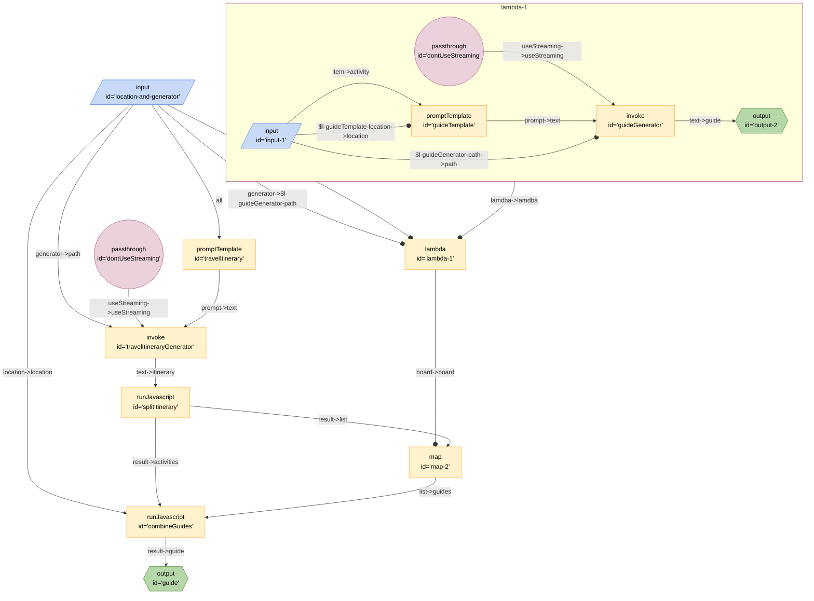

## tour-guide-writer.ts

```mermaid
%%{init: 'themeVariables': { 'fontFamily': 'Fira Code, monospace' }}%%
graph TD;
locationandgenerator[/"input <br> id='location-and-generator'"/]:::input -- "generator->path" --> travelItineraryGenerator["invoke <br> id='travelItineraryGenerator'"]
dontUseStreaming(("passthrough <br> id='dontUseStreaming'")):::passthrough -- "useStreaming->useStreaming" --> travelItineraryGenerator["invoke <br> id='travelItineraryGenerator'"]
locationandgenerator[/"input <br> id='location-and-generator'"/]:::input -- "generator->$l-guideGenerator-path" --o lambda1["lambda <br> id='lambda-1'"]
locationandgenerator[/"input <br> id='location-and-generator'"/]:::input -- "location->$l-guideTemplate-location" --o lambda1["lambda <br> id='lambda-1'"]
lambda1["lambda <br> id='lambda-1'"] -- "board->board" --o map2["map <br> id='map-2'"]
subgraph sg_lambda1 [lambda-1]
lambda1_dontUseStreaming(("passthrough <br> id='dontUseStreaming'")):::passthrough -- "useStreaming->useStreaming" --> lambda1_guideGenerator["invoke <br> id='guideGenerator'"]
lambda1_guideGenerator["invoke <br> id='guideGenerator'"] -- "text->guide" --> lambda1_output2{{"output <br> id='output-2'"}}:::output
lambda1_guideTemplate["promptTemplate <br> id='guideTemplate'"] -- "prompt->text" --> lambda1_guideGenerator["invoke <br> id='guideGenerator'"]
lambda1_input1[/"input <br> id='input-1'"/]:::input -- "item->activity" --> lambda1_guideTemplate["promptTemplate <br> id='guideTemplate'"]
lambda1_input1[/"input <br> id='input-1'"/]:::input -- "$l-guideGenerator-path->path" --o lambda1_guideGenerator["invoke <br> id='guideGenerator'"]
lambda1_input1[/"input <br> id='input-1'"/]:::input -- "$l-guideTemplate-location->location" --o lambda1_guideTemplate["promptTemplate <br> id='guideTemplate'"]
end
sg_lambda1:::slotted -- "lamdba->lamdba" --o lambda1

combineGuides["runJavascript <br> id='combineGuides'"] -- "result->guide" --> guide{{"output <br> id='guide'"}}:::output
locationandgenerator[/"input <br> id='location-and-generator'"/]:::input -- "location->location" --> combineGuides["runJavascript <br> id='combineGuides'"]
splitItinerary["runJavascript <br> id='splitItinerary'"] -- "result->activities" --> combineGuides["runJavascript <br> id='combineGuides'"]
map2["map <br> id='map-2'"] -- "list->guides" --> combineGuides["runJavascript <br> id='combineGuides'"]
splitItinerary["runJavascript <br> id='splitItinerary'"] -- "result->list" --> map2["map <br> id='map-2'"]
travelItineraryGenerator["invoke <br> id='travelItineraryGenerator'"] -- "text->itinerary" --> splitItinerary["runJavascript <br> id='splitItinerary'"]
travelItinerary["promptTemplate <br> id='travelItinerary'"] -- "prompt->text" --> travelItineraryGenerator["invoke <br> id='travelItineraryGenerator'"]
locationandgenerator[/"input <br> id='location-and-generator'"/]:::input -- all --> travelItinerary["promptTemplate <br> id='travelItinerary'"]
classDef default stroke:#ffab40,fill:#fff2ccff,color:#000
classDef input stroke:#3c78d8,fill:#c9daf8ff,color:#000
classDef output stroke:#38761d,fill:#b6d7a8ff,color:#000
classDef passthrough stroke:#a64d79,fill:#ead1dcff,color:#000
classDef slot stroke:#a64d79,fill:#ead1dcff,color:#000
classDef config stroke:#a64d79,fill:#ead1dcff,color:#000
classDef secrets stroke:#db4437,fill:#f4cccc,color:#000
classDef slotted stroke:#a64d79
```