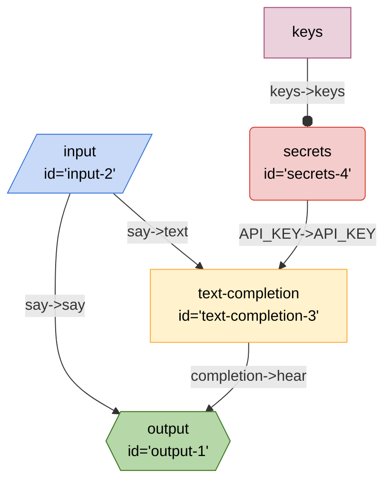

# Breadboard quick start

If you like learning by starting with simple examples that get more complex with each chapter, this guide might be a good fit.

## Chapter 1: Hello, world?

At the heart of the library is the concept of a `Board`. Just like for hardware makers, the `Board` is the place where wiring of a prototype happens.

To create a board:

```js
import { Board } from "@google-labs/breadboard";

const board = new Board();
```

Now that you have a board, you can place nodes on it. Think of nodes as the spiritual equivalent of hardware components that a maker might buy at the RadioShack. They are the building blocks of your application.

Let's place a node on the board:

```js
const input = board.input();
```

An `input` node is a node that asks for input from the user. It's a good place to start. Now let's place another node:

```js
const output = board.output();
```

Now we have two nodes on the board. Let's wire them together:

```js
input.wire("say->hear", output);
```

The statement above says: "take the `say` output of the `input` node and wire it to the `hear` input of the `output` node".

Every node has the `wire` method. It always takes two parameters:

- the first parameter describes what to wire, and
- the second parameter is the node that is being wired with the current node.

Now that we've wired our nodes, we can ask our breadboard to run:

```js
const result = await board.runOnce({
  say: "Hello, world?",
});
console.log("result", result);
```

When run, our tiny program will produce the following output:

```sh
result { hear: 'Hello, world?' }
```

> **🔍✨ What happened here?** The outcome should be fairly intuitive, but let's go through the process step by step:
>
> 1. The `runOnce` method of the board takes a property bag (a JS object) as its argument.
> 2. This bag of properties is then handed to the `input` node.
> 3. The `input` node is very simple-minded: it just passes the property bag along to the next node.
> 4. This is where the wiring comes in. When we described our single wire as `text->text`, we basically said:
>    1. reach into the property bag,
>    2. fish out the `text` property, then
>    3. pass it along to the next node as `text` property.
> 5. Since the next node is the `output` node, that's the node that receives the `text` property.
> 6. The `output` node is also pretty simple. It takes the property bag it received and returns it as the of the `runOnce` method.

You can see the source of this program [here](./examples/quick-start-1.js).

## Chapter 2: Wiring more nodes

This is definitely a fun little program, but it's not very useful. Let's add another node to the board. This time, we need a kit: a collection of nodes that are bundled together for a specific purpose.

Because we're here to make generative AI applications, we'll get the [LLM Starter Kit](https://github.com/google/labs-prototypes/tree/main/seeds/llm-starter):

```js
import { Board } from "@google-labs/breadboard";
import { Starter } from "@google-labs/llm-starter";

const board = new Board();
// add kit to the board
const kit = board.addKit(Starter);
```

The last line of the code snippet above is signficant: it adds a kit to the board. Calling the `addKit` method creates a new instance of the LLM Starter kit that is connected to our board.

Now that we've added the kit, we can use it to add nodes from it:

```js
const input = board.input();
const output = board.output();
const textCompletion = kit.textCompletion();
```

The `textCompletion` node that we've added is a node that uses the [PaLM API](https://developers.generativeai.google/) to generate text. This node takes a `text` property as an input and returns a `completion` property.

All we need to do is wire these properties to `say` and `hear` from before:

```js
input.wire("say->text", textCompletion);
textCompletion.wire("completion->hear", output);
```

Now, we have not one, but two wires on the board, connecting our three nodes. There's the `say->text` wire that connects the `input` and `textCompletion` nodes, and there's the `completion->hear` wire that connects the `textCompletion` and `output` nodes.

To make this program go, we need another node and a wire. The PaLM API behind the `textCompletion` node requires an API key, so we'll add a `secrets` node to the board:

```js
const secrets = kit.secrets(["API_KEY"]);
```

The `secrets` node reaches into our program's environment and gets the environment variable that is named `API_KEY`, as we specified in its argument. A `secrets` node could look for any other environment variables, we just need to specify which ones. For now, we only need the `API_KEY`.

Let's also import and use the `dotenv` package that conveniently reads environment variables from a `.env` file:

```js
import { config } from "dotenv";

config();
```

Let's also not forget to create a `.env` file and put our API key there:

```sh
API_KEY="your API key goes here"
```

With this bit of prep work out of the way, we're ready to wire the `secrets` node:

```js
secrets.wire("API_KEY->", textCompletion);
```

The statement above says: "wire `secret`'s output named `API_KEY` to the `textCompletion` input named `API_KEY`". Because we're wiring output to the input by the same name, we don't have to repeat ourselves.

Our second program is ready as soon as we add the `runOnce` call:

```js
const result = await board.runOnce({
  say: "Hi, how are you?",
});
console.log("result", result);
```

When run, our second program will produce output that might look something like this:

```sh
result { hear: 'Doing okay.' }
```

Oh hey! Our program is generating text using PaLM API.

You can see its source code here: [examples/quick-start-2.js](./examples/quick-start-2.js).

## Chatper 3: Fun with wires

So far, we've build a fairly simple board. Let's use this board to learn a bit more about convenient shortcuts and ways to wire nodes together.

First, the `wire` method returns the node itself, allowing us to wire the same node to multiple other nodes in a chain:

```js
const input = board.input();
const output = board.output();
const textCompletion = kit.textCompletion();
const secrets = kit.secrets(["API_KEY"]);

input.wire("say->text", textCompletion).wire("say->", output);
textCompletion.wire("completion->hear", output);
```

As you can see, we've used the chaining to add an extra wire to the `input` node. It goes straight to the `output` node, adding the `say` property to the output property bag. When we run this board, we'll see the following output:

```sh
result { say: 'Hi, how are you?', hear: 'doing okay' }
```

Second, we don't always need to create a new variable for each node. We can just create nodes as we wire them:

```js
board.input().wire("say->text", kit.textCompletion()).wire("say->", output);
```

Finally, we can we can wire in both directions. For example, we can wire the `secrets` node to the `textCompletion` node like this:

```js
textCompletion.wire("<-API_KEY", kit.secrets(["API_KEY"]));
```

Here, the arrow points in a different direction, and asks the board to wire the `API_KEY` output of the `secrets` node to the same input of the `textCompletion` node. It's equivalent to the wiring we had in the previous chapter.

Applying these newly learned techniques, we can rewrite our program like this:

```js
const output = board.output();
board
  .input()
  .wire("say->", output)
  .wire(
    "say->text",
    kit
      .textCompletion()
      .wire("completion->hear", output)
      .wire("<-API_KEY", kit.secrets(["API_KEY"]))
  );
```

It is more compact, but can be harder to read for those who are just starting to learn Breadboard. It's up to you to decide which style you prefer.

You can see the source code from this chapter here: [examples/quick-start-3.js](./examples/quick-start-3.js).

## Chapter 4: Loading, saving, and visualizing boards

Once the board is created, it can be used by the program that made it. But what if we want to reuse the board we made?

Conveniently, boards are serializable as JSON:

```js
const json = JSON.stringify(board);
```

Or, with better formatting:

```js
const json = JSON.stringify(board, null, 2);
```

The resulting JSON string can be trivially saved into a file:

```js
import { writeFile } from "fs/promises";

await writeFile("quick-start-4.json", json);
```

... and loaded from file with `Board.load`:

```js
const board2 = await Board.load("./quick-start-4.json");
```

Once we have the new board loaded, we can run it:

```js
const result = await board2.runOnce({
  say: "Hi, how are you?",
});

console.log("result", result);
```

And get the output like:

```sh
result { say: 'Hi, how are you?', hear: 'Doing alright.' }
```

Saving and loading boards means that we can now share the boards with others outside of the programs we wrote, and that creates all kind of interesting possibilities.

As the capstone for this chapter, let's draw some diagrams. Every board can be turned into a [Mermaid](https://mermaid.js.org/) diagram. All we need to do is call the `mermaid` method:

Running the program produces this:

```
%%{init: 'themeVariables': { 'fontFamily': 'Fira Code, monospace' }}%%
graph TD;
input2[/"input
id='input-2'"/]:::input -- "say->say" --> output1{{"output
id='output-1'"}}:::output
textcompletion3["text-completion
id='text-completion-3'"] -- "completion->hear" --> output1{{"output
id='output-1'"}}:::output
secrets4("secrets
id='secrets-4'"):::secrets -- "API_KEY->API_KEY" --> textcompletion3["text-completion
id='text-completion-3'"]
input2[/"input
id='input-2'"/]:::input -- "say->text" --> textcompletion3["text-completion
id='text-completion-3'"]
keyssecrets4[keys]:::config -- "keys->keys" --o secrets4
classDef default stroke:#ffab40,fill:#fff2ccff,color:#000
classDef input stroke:#3c78d8,fill:#c9daf8ff,color:#000
classDef output stroke:#38761d,fill:#b6d7a8ff,color:#000
classDef passthrough stroke:#a64d79,fill:#ead1dcff,color:#000
classDef slot stroke:#a64d79,fill:#ead1dcff,color:#000
classDef config stroke:#a64d79,fill:#ead1dcff,color:#000
classDef secrets stroke:#db4437,fill:#f4cccc,color:#000
classDef slotted stroke:#a64d79
```

Which when viewed with Mermaid, looks like this:



Coincidentally, Github Markdown has great support for Mermaid. Just paste the Mermaid output as code into the doc as source code marked as `mermaid`:

````markdown
```mermaid
<put code here>
```
````

You can see this chapter's source code here: [examples/quick-start-4.js](./examples/quick-start-4.js).

## Chapter 5: Including other boards

## Chapter 6: Boards with slots

<!--

## Templates and memory

Let's see if we can teach this board to act like a chat bot. To get there, it needs to learn two new skills: the ability to remember the conversation and have some sense of its role in a conversation.

Let's start with the last bit first. To teach our program to act in a certain way, we'll need a `textTemplate` node.

```js
const textTemplate = kit.textTemplate(
  "This is a conversation between a friendly assistant and their user." +
    "You are the assistant and your job is to try to be helpful, empathetic," +
    "and fun.\n\n" +
    "== Conversation History\n" +
    "{{context}}\n\n" +
    "== Current Conversation" +
    "\nuser: {{question}}\n" +
    "assistant:"
);
```

The `textTemplate` node takes a template string as its argument. The template string is a string that can contain placeholders. The placeholders are enclosed in double curly braces, like this: `{{placeholder}}`. The node replaces placholders with the values of the properties that are passed to it.

So, in the code snippet above, this node needs to have these two properties wired into it:

- `context`, which will contain conversation history so far, and
- `question`, the latest question the user asked. -->

## Chapter 7: Let's go make something!
