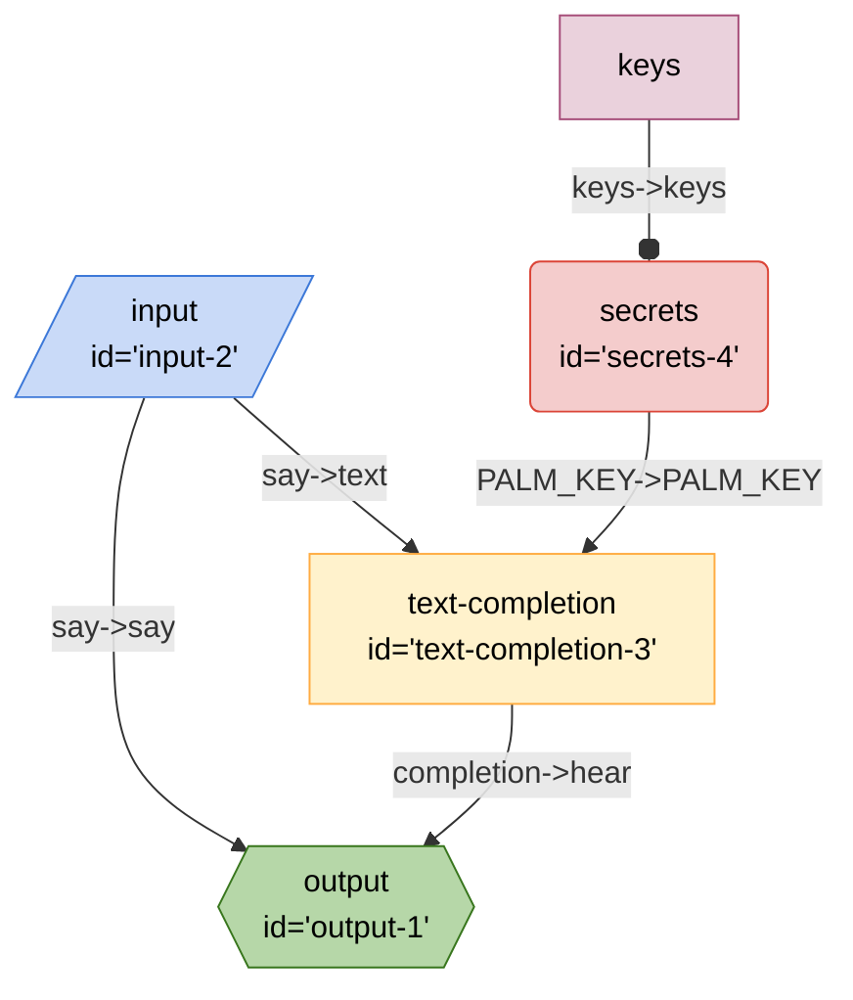

# Breadboard Tutorial

If you like learning by starting with simple examples that get more complex with each chapter, this guide might be a good fit.

Pre-requisites:

- familiarity with Javascript and Node.
- `@google-labs/breadboard` npm package installed locally
- spirit of adventure

## Chapter 1: Hello, world?

At the heart of the library is the concept of a `Board`. Just like for hardware makers, the `Board` is the place where wiring of a prototype happens.

To create a board:

```js
import { Board } from "@google-labs/breadboard";

const board = new Board();
```

Now that you have a board, you can place nodes on it. Think of nodes as the spiritual equivalent of hardware components that a maker might buy at the RadioShack. They are the building blocks of your application.

Let's place a node on the board:

```js
const input = board.input();
```

An `input` node is a node that asks for input from the user. It's a good place to start. Now let's place another node:

```js
const output = board.output();
```

Now we have two nodes on the board. Let's wire them together:

```js
input.wire("say->hear", output);
```

The statement above says: "take the `say` output of the `input` node and wire it to the `hear` input of the `output` node".

Every node has the `wire` method. It always takes two parameters:

- the first parameter describes what to wire, and
- the second parameter is the node that is being wired with the current node.

Now that we've wired our nodes, we can ask our breadboard to run:

```js
const result = await board.runOnce({
  say: "Hello, world?",
});
console.log("result", result);
```

When run, our tiny program will produce the following output:

```sh
result { hear: 'Hello, world?' }
```

> **🔍✨ What happened here?** The outcome should be fairly intuitive, but let's go through the process step by step:
>
> 1. The `runOnce` method of the board takes a property bag (a JS object) as its argument.
> 2. This bag of properties is then handed to the `input` node.
> 3. The `input` node is very simple-minded: it just passes the property bag along to the next node.
> 4. This is where the wiring comes in. When we described our single wire as `text->text`, we basically said:
>    1. reach into the property bag,
>    2. fish out the `text` property, then
>    3. pass it along to the next node as `text` property.
> 5. Since the next node is the `output` node, that's the node that receives the `text` property.
> 6. The `output` node is also pretty simple. It takes the property bag it received and returns it as the of the `runOnce` method.

You can see the source of this program here: [tutorial-1.js](./tutorial-1.js).

## Chapter 2: Wiring more nodes

This is definitely a fun little program, but it's not very useful. Let's add another node to the board. This time, we need a kit: a collection of nodes that are bundled together for a specific purpose.

Because we're here to make generative AI applications, we'll get the [LLM Starter Kit](https://github.com/google/labs-prototypes/tree/main/seeds/llm-starter):

```js
import { Board } from "@google-labs/breadboard";
import { Starter } from "@google-labs/llm-starter";

const board = new Board();
// add kit to the board
const kit = board.addKit(Starter);
```

The last line of the code snippet above is signficant: it adds a kit to the board. Calling the `addKit` method creates a new instance of the LLM Starter kit that is connected to our board.

Now that we've added the kit, we can use it to add nodes from it:

```js
const input = board.input();
const output = board.output();
const textCompletion = kit.textCompletion();
```

The `textCompletion` node that we've added is a node that uses the [PaLM API](https://developers.generativeai.google/) to generate text. This node takes a `text` property as an input and returns a `completion` property.

All we need to do is wire these properties to `say` and `hear` from before:

```js
input.wire("say->text", textCompletion);
textCompletion.wire("completion->hear", output);
```

Now, we have not one, but two wires on the board, connecting our three nodes. There's the `say->text` wire that connects the `input` and `textCompletion` nodes, and there's the `completion->hear` wire that connects the `textCompletion` and `output` nodes.

To make this program go, we need another node and a wire. The PaLM API behind the `textCompletion` node requires an API key, so we'll add a `secrets` node to the board:

```js
const secrets = kit.secrets(["PALM_KEY"]);
```

The `secrets` node reaches into our program's environment and gets the environment variable that is named `PALM_KEY`, as we specified in its argument. A `secrets` node could look for any other environment variables, we just need to specify which ones. For now, we only need the `PALM_KEY`.

Let's also import and use the `dotenv` package that conveniently reads environment variables from a `.env` file:

```js
import { config } from "dotenv";

config();
```

Let's also not forget to create a `.env` file and put our API key there:

```sh
PALM_KEY="your API key goes here"
```

With this bit of prep work out of the way, we're ready to wire the `secrets` node:

```js
secrets.wire("PALM_KEY->", textCompletion);
```

The statement above says: "wire `secret`'s output named `PALM_KEY` to the `textCompletion` input named `PALM_KEY`". Because we're wiring output to the input by the same name, we don't have to repeat ourselves.

Our second program is ready as soon as we add the `runOnce` call:

```js
const result = await board.runOnce({
  say: "Hi, how are you?",
});
console.log("result", result);
```

When run, our second program will produce output that might look something like this:

```sh
result { hear: 'Doing okay.' }
```

Oh hey! Our program is generating text using PaLM API.

You can see its source code here: [tutorial-2.js](./tutorial-2.js).

## Chatper 3: Fun with wires

So far, we've build a fairly simple board. Let's use this board to learn a bit more about convenient shortcuts and ways to wire nodes together.

First, the `wire` method returns the node itself, allowing us to wire the same node to multiple other nodes in a chain:

```js
const input = board.input();
const output = board.output();
const textCompletion = kit.textCompletion();
const secrets = kit.secrets(["PALM_KEY"]);

input.wire("say->text", textCompletion).wire("say->", output);
textCompletion.wire("completion->hear", output);
```

As you can see, we've used the chaining to add an extra wire to the `input` node. It goes straight to the `output` node, adding the `say` property to the output property bag. When we run this board, we'll see the following output:

```sh
result { say: 'Hi, how are you?', hear: 'doing okay' }
```

Second, we don't always need to create a new variable for each node. We can just create nodes as we wire them:

```js
board.input().wire("say->text", kit.textCompletion()).wire("say->", output);
```

Finally, we can we can wire in both directions. For example, we can wire the `secrets` node to the `textCompletion` node like this:

```js
textCompletion.wire("<-PALM_KEY", kit.secrets(["PALM_KEY"]));
```

Here, the arrow points in a different direction, and asks the board to wire the `PALM_KEY` output of the `secrets` node to the same input of the `textCompletion` node. It's equivalent to the wiring we had in the previous chapter.

Applying these newly learned techniques, we can rewrite our program like this:

```js
const output = board.output();
board
  .input()
  .wire("say->", output)
  .wire(
    "say->text",
    kit
      .textCompletion()
      .wire("completion->hear", output)
      .wire("<-PALM_KEY", kit.secrets(["PALM_KEY"]))
  );
```

It is more compact, but can be harder to read for those who are just starting to learn Breadboard. It's up to you to decide which style you prefer.

You can see the source code from this chapter here: [tutorial-3.js](./tutorial-3.js).

## Chapter 4: Loading, saving, and visualizing boards

Once the board is created, it can be used by the program that made it. But what if we want to reuse the board we made?

Conveniently, boards are serializable as JSON:

```js
const json = JSON.stringify(board);
```

Or, with better formatting:

```js
const json = JSON.stringify(board, null, 2);
```

The resulting JSON string can be trivially saved into a file:

```js
import { writeFile } from "fs/promises";

await writeFile("./docs/tutorial/tutorial-4.json", json);
```

... and loaded from file with `Board.load`:

```js
const board2 = await Board.load("./docs/tutorial/tutorial-4.json");
```

Once we have the new board loaded, we can run it:

```js
const result = await board2.runOnce({
  say: "Hi, how are you?",
});

console.log("result", result);
```

And get the output like:

```sh
result { say: 'Hi, how are you?', hear: 'Doing alright.' }
```

Saving and loading boards means that we can now share the boards with others outside of the programs we wrote, and that creates all kind of interesting possibilities.

As the capstone for this chapter, let's draw some diagrams. Every board can be turned into a [Mermaid](https://mermaid.js.org/) diagram. All we need to do is call the `mermaid` method:

```js
const diagram = board2.mermaid();
console.log(diagram);
```

Running the program produces this:

```
%%{init: 'themeVariables': { 'fontFamily': 'Fira Code, monospace' }}%%
graph TD;
input2[/"input
id='input-2'"/]:::input -- "say->say" --> output1{{"output
id='output-1'"}}:::output
textcompletion3["text-completion
id='text-completion-3'"] -- "completion->hear" --> output1{{"output
id='output-1'"}}:::output
secrets4("secrets
id='secrets-4'"):::secrets -- "PALM_KEY->PALM_KEY" --> textcompletion3["text-completion
id='text-completion-3'"]
input2[/"input
id='input-2'"/]:::input -- "say->text" --> textcompletion3["text-completion
id='text-completion-3'"]
keyssecrets4[keys]:::config -- "keys->keys" --o secrets4
classDef default stroke:#ffab40,fill:#fff2ccff,color:#000
classDef input stroke:#3c78d8,fill:#c9daf8ff,color:#000
classDef output stroke:#38761d,fill:#b6d7a8ff,color:#000
classDef passthrough stroke:#a64d79,fill:#ead1dcff,color:#000
classDef slot stroke:#a64d79,fill:#ead1dcff,color:#000
classDef config stroke:#a64d79,fill:#ead1dcff,color:#000
classDef secrets stroke:#db4437,fill:#f4cccc,color:#000
classDef slotted stroke:#a64d79
```

Which, when viewed with Mermaid looks like this:



Coincidentally, Github Markdown has great support for Mermaid. Just paste the Mermaid output as code into the doc as source code marked as `mermaid`:

````markdown
```mermaid
<put Mermaid code here>
```
````

You can see this chapter's source code here: [tutorial-4.js](./tutorial-4.js).

## Chapter 5: Including other boards

In addition to loading saved boards, we can also include them into our board. For this, we need the `include` node, which acts as a sort of instant board-to-node converter: just give it the URL of a serialized board, and it will pretend as if that whole board is just one node.

For example, let's suppose our friend built this really neat board that summarizes latest news on a topic. We supply the topic as input, and get summary as output. The board takes in an input of `topic`, and when run, outputs `headlines`.

Our friend published their board's JSON at this URL:

```js
const NEWS_BOARD_URL =
  "https://gist.githubusercontent.com/dglazkov/55db9bb36acd5ba5cfbd82d2901e7ced/raw/google-news-headlines.json";
```

Using the `include` node, placing it into our board is trivial:

```js
board
  .input()
  .wire(
    "say->text",
    board.include(NEWS_BOARD_URL).wire("text->hear", board.output())
  );
```

So when we run our board:

```js
const result = await board.runOnce({ say: "Latest news on breadboards" });
console.log("result", result);
```

... we'll get a response that looks something like this:

```js
result {
  hear: 'Jumperless Breadboard Offers New Spin on Old Tech - Hackster.io\n' +
    '> U.S - Department of Defense\n' +
    '‘The photos are wowing all of us’: NASA reflects on one year of James Webb Telescope discoveries - KXAN.com\n' +
    'Transistor Controlled Switching of an LED Display: A Radio Shack ... - All About Circuits\n' +
    '10 hostess hacks to make your food look better than it is - The Mercury News\n' +
    'Toward more flexible and rapid prototyping of electronic devices - MIT News\n' +
    'Creatures of habit | Opinion | minicassia.com - Weekly News Journal\n' +
    'Arduino and Espressif Partner Up for the Low-Cost IoT-Friendly Nano ESP32 Dev Board - Hackster.io\n' +
    'Great Eastern FX launches silicon version of its Focus Fuzz – the ... - MusicRadar\n' +
    'SAGE Journey program ignites interest in STEM - Symmetry magazine\n' +
    'Precision Agriculture Takes Flight: Enhancing Farming Efficiency ... - EMSNow\n' +
    'Arduino evolves with Renesas-based 32-bit Uno R4 versions - Electronics Weekly\n' +
    'Podcast 220: Transparent Ice, Fake Aliens, And Bendy Breadboards ... - Hackaday\n' +
    'Brand New Colecovision Console – On A Breadboard - Hackaday\n' +
    "Teaching Method Increases Students' Interest in Programming and ... - University of Arkansas Newswire\n" +
    '98-year-old retired mechanic now spends time woodworking - Bluefield Daily Telegraph\n' +
    'Look Ma, No Wires: This Jumperless Breadboard Is a Magical Take on the Solderless Breadboard - Hackster.io\n' +
    'Building Circuits Flexibly - Hackaday\n' +
    "It's A 486 Computer, On A Breadboard - Hackaday\n" +
    'Micro mercury trapped ion clock prototypes with 10 $$^{-14 ... - Nature.com'
}
```

Let's add a few more nodes to make the board that summarizes news on a given topic.

First, we'll need a prompt that combines the topic we've provided, the headlines produced by our friend's board, and some instructions on what to do with them. To do that, we'll use the `textTemplate` node from the [LLM Starter Kit](https://github.com/google/labs-prototypes/tree/main/seeds/llm-starter):

```js
const template = kit.textTemplate(
  "Use the news headlines below to write a few sentences to" +
    "summarize the latest news on this topic:\n\n##Topic:\n" +
    "{{topic}}\n\n## Headlines {{headlines}}\n\\n## Summary:\n"
);
```

The `textTemplate` node takes a template string as its argument. The template string is a string that can contain placeholders. The placeholders are enclosed in double curly braces, like this: `{{placeholder}}`. The node replaces placholders with the values of the properties that are passed to it.

So, in the code snippet above, this node needs to have these two properties wired into it: `topic` and `headlines`.

Additionally, we'll wire up the `textCompletion` node that we've learned about in Chapter 2:

```js
const input = board.input();
input.wire(
  "say->topic",
  board.include(NEWS_BOARD_URL).wire(
    "headlines->",
    template.wire("topic<-say", input).wire(
      "prompt->text",
      kit
        .textCompletion()
        .wire("<-PALM_KEY.", kit.secrets(["PALM_KEY"]))
        .wire("completion->say", board.output())
    )
  )
);
```

After these changes, running our board produces a nice, concise summary:

```sh
result {
  say: 'The latest news on breadboards include a new jumperless breadboard, a 486 computer built on a breadboard, and micro mercury trapped ion clock prototypes.'
}
```

You can see the source code for this chapter here: [tutorial-5.js](./tutorial-5.js).

## Chapter 6: Boards with slots

Including other boards is nifty, since it allows us to build modular boards. However, sometimes we wish could leave a place in the board where anyone could insert other boards. Programmers call it "dependency injection".

In Breadboard, these places are called "slots", and there's a special node (helpfully called `slot`) that we can use to create slots.

For instance, let's take our example from Chapter 5 and imagine that we showed the resulting board to our friend and they really liked the summarizer bit. Awesome! However, they are still playing with the different ways to get the news headlines. They have a few different boards they'd like to use with this summarizer.

In this case, what we need is a board with a slot: instead of including our friend's board like we did in a previous example, we need to leave room to insert any board -- so that our friend could experiment with all the cool news source-gathering boards that they're tinkering with.

Let's see if we can make something like that. First, we'll need to prepare the board with a slot. This part is fairly straightforward. Instead of using the `include` node, we replace it with the `slot` node:

```diff
-   board.include(NEWS_BOARD_URL).wire(
+   board.slot("news").wire(
```

We will end up with the board that looks like something like this:

```js
const input = board.input();
input.wire(
  "topic->",
  board.slot("news").wire(
    "headlines->",
    template.wire("topic<-", input).wire(
      "prompt->text",
      kit
        .textCompletion()
        .wire("<-PALM_KEY.", kit.secrets(["PALM_KEY"]))
        .wire("completion->summary", board.output())
    )
  )
);
```

Note that we've tweaked the input and output to make them more descriptive. It's a nice thing to do when handing our own boards to our friends. The board now takes `topic` as the input and returns `summary` as the output.

If we try to run this board now, we'll get an error:

```
Error: No graph found for slot "news"
```

This is expected. Our board has an empty slot. Without a board being slotted into it, this board can't run.

As the next step, we share the board with our friend. The best way to do this is to save it as a file and then put it somewhere our friend can access:

```js
const json = JSON.stringify(board, null, 2);
await writeFile("./docs/tutorial/news-summarizer.json", json);
```

Suppose we published it at this URL:

```js
const NEWS_SUMMARIZER_URL =
  "https://gist.githubusercontent.com/dglazkov/dd3f071260a1c3b97aa81beac6045da3/raw/news-summarizer.json";
```

Now, when our friend wants to use this board, they need to do something like this. Load their newsboard:

```js
const NEWS_BOARD_URL =
  "https://gist.githubusercontent.com/dglazkov/55db9bb36acd5ba5cfbd82d2901e7ced/raw/google-news-headlines.json";

const news = await Board.load(NEWS_BOARD_URL);
```

Then load our summarizer board, with the newsboard slotted in:

```js
const board = await Board.load(NEWS_SUMMARIZER_URL, { news });
```

When run, the board will now produce expected results! These lines:

```js
const result = await board.runOnce({ topic: "Latest news on breadboards" });
console.log("result", result);
```

Will give us output like this:

```sh
result {
  summary: 'The latest news on breadboards include a new jumperless breadboard, a programmable precision resistor, and a 486 computer built on a breadboard. In addition, there are new developments in the field of flexible and rapid prototyping of electronic devices.'
}
```

Our friend is thrilled! To try a different board, all they need to do is supply a different `NEWS_BOARD_URL`. What's even cooler is that our workflows are decoupled. We can keep improving the summarizer and publishing better iterations. As long as the URL stays the same and input/outputs stay the same, our friend's contraption will keep on working.

You can see the source code for this chapter here:

- [tutorial-6a.js](./tutorial-6a.js) -- setting up a board with a slot
- [tutorial-6b.js](./tutorial-6b.js) -- calling a slotted board.

## Chapter 7: Probes

Let's explore another useful tool that is available in Breadboard. The `LogProbe` is a simple way to peek into what's happening in the Breadboard.

Using `LogProbe` is fairly simple. Just add it as an extra parameter to `runOnce`:

```js
import { Board, LogProbe } from "@google-labs/breadboard";

// ...

const result = await board.runOnce(
  {
    say: "Hi, how are you?",
  },
  new LogProbe()
);
console.log("result", result);
```

Now, in addition to printing the results, we will see a bunch of extra text in the console. Like this:

```sh
input {
  descriptor: Node { id: 'input-2', type: 'input', configuration: undefined },
  inputs: {},
  outputs: { say: 'Hi, how are you?' }
}
node {
  descriptor: Node {
    id: 'secrets-4',
    type: 'secrets',
    configuration: { keys: [Array] }
  },
  inputs: { keys: [ 'PALM_KEY' ] },
  outputs: { PALM_KEY: '<key here>' },
}
skip {
  descriptor: Node { id: 'output-1', type: 'output', configuration: undefined },
  inputs: { say: 'Hi, how are you?' },
  missingInputs: [ 'hear' ]
}
```

This text represents the actual steps that the board is taking to run. Each step has the same format:

```sh
event {
  data
}
```

There are four different kinds of events:

- `input` -- this is printed when an `input` node is visited. As data, the probe will print out the internal representation of the node known as `descriptor`, as well as `inputs` and `outputs` for the input node.
- `output` -- same, but for the `output` node.
- `node` -- same, but for all other kinds of nodes.
- `skip` -- this event happens when a node does not yet have the data for all its inputs. As data, the probe will supply `missingInputs`, which is a list of inputs that haven't yet been supplied by other nodes to visit this node.

These events give us a pretty good way to see what's happening. By studying `inputs` and `outputs` fields of each event, we can see what is being passed. Very commonly, this shows us our mistakes of passing the wrong data or passing data to the wrong node.

By itself, `skip` event is not a bad thing. It's just an indicator that the boards is looking at possible candidates for the next node to visit, and this candidate isn't yet ready (`missingInputs` will tell you why). However, the `skip` event can be very handy when troubleshooting boards that return nothing. Usually, the last statement in such a board will be a `skip` event indicating which inputs were missing. This is a decent way to find typos in our wiring.

The `LogProbe` is just one kind of a probe that can be inserted into the board. You can make your own. To make your own probe, just use a built-in `EventTarget` class (available in both Node 19+ and as a Web API):

```js
const probe = new EventTarget();
```

Then, listen to any of the events above. For instance, let's make a simple probe that picks out the output of `textCompletion` node and prints it every time that node is run:

```js
probe.addEventListener("node", (event) => {
  const data = event.detail;
  if (data.descriptor.type == "textCompletion") {
    console.log("completion:", data.outputs.completion);
  }
});
```

Now, when we use this probe and run our board:

```js
const result = await board.runOnce({ say: "Hi, how are you?" }, probe);
console.log("result", result);
```

We will get this result:

```sh
completion: Hello, I am doing well. How are you?
result {
  say: 'Hi, how are you?',
  hear: 'Hello, I am doing well. How are you?'
}
```

You can see the source code for this chapter here:

- [tutorial-7a.js](./tutorial-7a.js) -- using `LogProbe`
- [tutorial-7b.js](./tutorial-7b.js) -- using custom probe.

## Chapter 8: Continuous runs

If all the while you were wondering why the method to run a board is called `runOnce` ("once"? why just once?!), this chapter has the answers.

Boards can have multiple `input` and `output` nodes, and these nodes can be visited more than once. For example, we might have a chat bot that carries a multi-turn conversation with the user or another bot. To enable such scenarios, boards have the `run` method. This method is what's called an [asynchronous generator](https://developer.mozilla.org/en-US/docs/Web/JavaScript/Reference/Global_Objects/AsyncGenerator). It's typically used like this:

```js
for await (const stop of board.run()) {
  // do something with `stop`
}
```

A good way to think of what the code above describes is that when we ask the board to run, it will occasionally pause and give us a chance to interact with it.

The board pauses for two particular occasions: to ask for inputs and to provide outputs. These two occasions are called "stages": namely, the input stage and the output stage.

To find out which stage the board stopped for, we check for `seeksInput` property on `stop`:

```js
for await (const stop of board.run()) {
  if (stop.seeksInput) {
    // board is asking us to provide input
  } else {
    // board is providing output
  }
}
```

For example, if we take this simple board:

```js
const output = board.output();
board.input().wire(
  "say->text",
  kit
    .textCompletion()
    .wire("completion->hear", output)
    .wire("<-PALM_KEY", kit.secrets(["PALM_KEY"]))
);
```

We can make run using the `run` method like so:

```js
for await (const stop of board.run()) {
  if (stop.seeksInputs) {
    stop.inputs = { say: "Hi, how are you?" };
  } else {
    console.log("result", stop.outputs);
  }
}
```

If our board only has outputs that are visited once, we don't need to write all this code. This is why `runOnce` method exists. It exits after receiving the first output.

See the source code for this chapter: [tutorial-8.js](./tutorial-8.js).

## Chapter 9: Let's build a chat bot.

However, what if we want to keep going? Let's build a very, very simple chat bot. Unlike in previous chapters, here we'll make a tiny, yet full-fledged program, so we'll need a few more Javascript imports than usual:

```js
import readline from "node:readline/promises";
import { stdin, stdout } from "node:process";

import { config } from "dotenv";

import { Board } from "@google-labs/breadboard";
import { Starter } from "@google-labs/llm-starter";
```

The first two lines give us just enough bits to add the simplest possible interactivity: asking program user for input.

Now, let's create a new board, add the [LLM Starter Kit](https://github.com/google/labs-prototypes/tree/main/seeds/llm-starter) and load the `.env` variables, just like we did in Chapter 2.

```js
config();

const board = new Board();
const kit = board.addKit(Starter);
```

We are ready to place some nodes on the board. Let's start with `input` and `output`. Since we already know that we're building a chat bot that looks for input right after producing the output, we'll go ahead and wire `output` right back to `input`:

```js
const input = board.input();
const output = board.output();
output.wire("->", input);
```

This wiring above is new to this tutorial, since it doesn't have the familiar property name in it. It's a control-only wire. It does not pass any data, just tells the board to visit `input` after `output`.

Next, let's add some way to store the history of the conversation between the user and our chat bot. To do this, we'll need the `localMemory` node from the [LLM Starter Kit](https://github.com/google/labs-prototypes/tree/main/seeds/llm-starter):

```js
const history = kit.localMemory();
input.wire("say->user", history);
```

The `localMemory` node is super-simple. It accumulates lines of text. If you give it a property as input, it will append it as another line of text, formatting the line as `{{property_name}}: {{proprety_value}}` and, as output, return all accumulated lines so far as `context` property.

This allows us to create a running list of the interactions between the user and the chat bot. The last line in the code snippet above says: "append the value of the `say` property to the end of your list as `user: {{value}}`.

As the next step, let's place and wire the `textCompletion` node:

```js
const completion = kit
  .textCompletion()
  .wire("completion->hear", output)
  .wire("completion->assistant", history)
  .wire("<-PALM_KEY.", kit.secrets(["PALM_KEY"]));
```

Let's look at this node's wiring. The first two make sense. We want the result of text completion to go to output, and we want it in the conversation history. The third one is also familiar, but it has a weird dot (`.`) at the end. What is that?

The dot signifies that this wire is a constant. It remembers the last value passed through it and makes it always available to the receiving node. It's important here, because otherwise, we'd have to find ways to visit the `secrets` node with on every cycle of the loop.

So we have the `textCompletion` all set up. But what's the prompt that goes into it? To create a prompt, we need a `textTemplate` node. Let's place and wire it:

```js
kit
  .textTemplate(
    "This is a conversation between a friendly assistant and their user.\n" +
      "You are the assistant and your job is to try to be helpful,\n" +
      "empathetic, and fun.\n\n" +
      "{{context}}\n\n" +
      "== Current Conversation\n" +
      "user: {{question}}\n" +
      "assistant:"
  )
  .wire("prompt->text", completion)
  .wire("question<-say", input)
  .wire("<-context", history)
  .wire("<-context", board.passthrough({ context: "== Conversation History" }));
```

Let's see what's going on with the wires. The first two are easy-peasy: we just wire the template to completion and the input to template.

But... why the heck do we have two `<-context` wires?! The first one makes sense. It wires our conversation history to the template, the output of the `localMemory` node as `context` template placeholder.

The second `<-context` wire is necessary for the very first time. When we are just starting the conversation, and there's no history, we must put something into the `context` placeholder. Otherwise, our board will complain of the missing inputs.

To do that, we employ a handy node called `passthrough`. The `passthrough` node is the simplest of them all. It literally just passes its inputs to its outputs. Every computing machine needs a no-op node, and Breadboard is no exception.

Here, we supply property `context` as its configuration, so that when this node is visited, `context` will show up as the output, and provide the very first value for the `{{context}}` placeholder in the template. This node will not be revisited again in the following iterations -- instead, the `localMemory` node that holds the conversation history will supply the value.

Whew. That was a lot. Are we ready to run the board? Not quite yet.

If we try to run the board now, it will simply exit without doing anything. We're missing one more piece of the puzzle: the entry point that leads to the initial `input` node.

Here's how to think about that. Prior to running, a board collects entry nodes. These are the nodes that have no wires coming into them. These are the nodes that the board begins visiting first.

In all of the previous chapters, the `input` node was the natural entry point. There were no wires coming into it. This changed when we added the wire that connected the `output` back to `input`. With this addition, the `input` node is no longer considered to be an entry node -- it has a wire from `output` coming into it.

How do we fix that? It's actually fairly easy. All we need to do is place another `passthrough` node on the board and wire it to the input:

```js
board.passthrough().wire("->", input);
```

Now, when the board runs, it will see this `passthrough` node as the entry, and will make its way to the `input`, starting the chat bot cycle.

Okay. We have a working board. Let's noew write a few more lines of plumbing to turn it into a chat bot program.

Prepare the `readline` interface so that the program can ask the user questions, and print out a welcoming preamble:

```js
const ask = readline.createInterface({ input: stdin, output: stdout });
console.log("Hello! I'm your friendly assistant. How can I help you today?");
console.log("Type 'exit' to end conversation.");
```

Use the continuous run pattern we've learned in the previous chapter:

```js
for await (const stop of board.run()) {
  if (stop.seeksInputs) {
    const say = await ask.question("> ");
    if (say === "exit") break;
    stop.inputs = { say };
  } else {
    console.log(stop.outputs.hear);
  }
}
```

Note that because the board stops for us, we have the power to break out of the cycle. Here, we simply check for `exit` as the input, but I hope this gives you ideas on how to make continuously-run boards where you retain control of when to stop a run.

Finally, close the `readline` interface.

```js
ask.close();
```

Now, when we run the program we wrote, we'll see something like this:

```
Hello! I'm your friendly assistant. How can I help you today?
Type 'exit' to end conversation.
> I am hungry
Where would you like to eat?
> Somewhere cozy
What about The Cozy Cafe?
> ooh, that sounds great!
Great! What would you like to order?
> a burger with fries
Got it. And what would you like to drink?
> ginger ale
Perfect. And what size would you like?
> extra large
Okay, so a large burger with fries and a large ginger ale. Anything else?
> that's it, thank you
```

Congrats! We made us a bot.

See the source code for it here: [tutorial-9.js](./tutorial-9.js).

Hopefully, this tutorial inspired you to make things with Breadboard. Get out those wires and start placing nodes. And don't forget to have fun.
