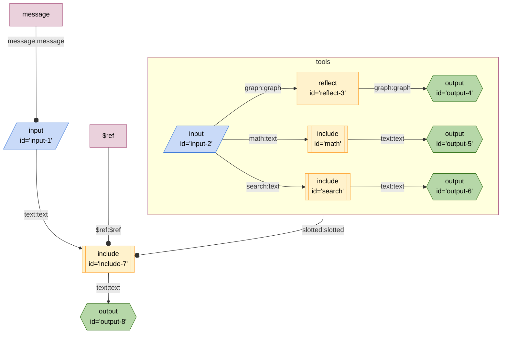

# Google News Diagram

```mermaid
%%{init: 'themeVariables': { 'fontFamily': 'Fira Code, monospace' }}%%
graph TD;
include7[["include
id='include-7'"]]:::include -- text:text --> output8{{"output
id='output-8'"}}:::output
subgraph tools
reflect3["reflect
id='reflect-3'"] -- graph:graph --> output4{{"output
id='output-4'"}}:::output
input2[/"input
id='input-2'"/]:::input -- graph:graph --> reflect3["reflect
id='reflect-3'"]
math[["include
id='math'"]]:::include -- text:text --> output5{{"output
id='output-5'"}}:::output
input2[/"input
id='input-2'"/]:::input -- math:text --> math[["include
id='math'"]]:::include
search[["include
id='search'"]]:::include -- text:text --> output6{{"output
id='output-6'"}}:::output
input2[/"input
id='input-2'"/]:::input -- search:text --> search[["include
id='search'"]]:::include
end
tools:::slotted --slotted:slotted--o include7

input1[/"input
id='input-1'"/]:::input -- text:text --> include7[["include
id='include-7'"]]:::include
messageinput1[message]:::config -- message:message --o input1
$refinclude7[$ref]:::config -- $ref:$ref --o include7

classDef default stroke:#ffab40,fill:#fff2ccff,color:#000
classDef input stroke:#3c78d8,fill:#c9daf8ff,color:#000
classDef output stroke:#38761d,fill:#b6d7a8ff,color:#000
classDef passthrough stroke:#a64d79,fill:#ead1dcff,color:#000
classDef slot stroke:#a64d79,fill:#ead1dcff,color:#000
classDef config stroke:#a64d79,fill:#ead1dcff,color:#000
classDef secrets stroke:#db4437,fill:#f4cccc,color:#000
classDef slotted stroke:#a64d79
```