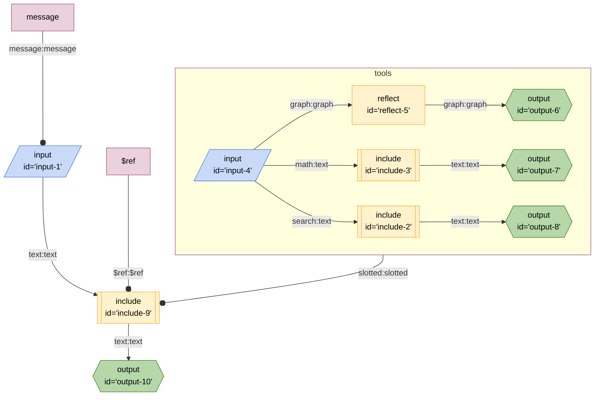

# Google News Diagram

```mermaid
%%{init: 'themeVariables': { 'fontFamily': 'Fira Code, monospace' }}%%
graph TD;
include9[["include
id='include-9'"]]:::include -- text:text --> output10{{"output
id='output-10'"}}:::output
subgraph tools
reflect5["reflect
id='reflect-5'"] -- graph:graph --> output6{{"output
id='output-6'"}}:::output
input4[/"input
id='input-4'"/]:::input -- graph:graph --> reflect5["reflect
id='reflect-5'"]
include3[["include
id='include-3'"]]:::include -- text:text --> output7{{"output
id='output-7'"}}:::output
input4[/"input
id='input-4'"/]:::input -- math:text --> include3[["include
id='include-3'"]]:::include
include2[["include
id='include-2'"]]:::include -- text:text --> output8{{"output
id='output-8'"}}:::output
input4[/"input
id='input-4'"/]:::input -- search:text --> include2[["include
id='include-2'"]]:::include
end
tools:::slotted --slotted:slotted--o include9

input1[/"input
id='input-1'"/]:::input -- text:text --> include9[["include
id='include-9'"]]:::include
messageinput1[message]:::config -- message:message --o input1
$refinclude9[$ref]:::config -- $ref:$ref --o include9

classDef default stroke:#ffab40,fill:#fff2ccff,color:#000
classDef input stroke:#3c78d8,fill:#c9daf8ff,color:#000
classDef output stroke:#38761d,fill:#b6d7a8ff,color:#000
classDef passthrough stroke:#a64d79,fill:#ead1dcff,color:#000
classDef slot stroke:#a64d79,fill:#ead1dcff,color:#000
classDef config stroke:#a64d79,fill:#ead1dcff,color:#000
classDef secrets stroke:#db4437,fill:#f4cccc,color:#000
classDef slotted stroke:#a64d79
```