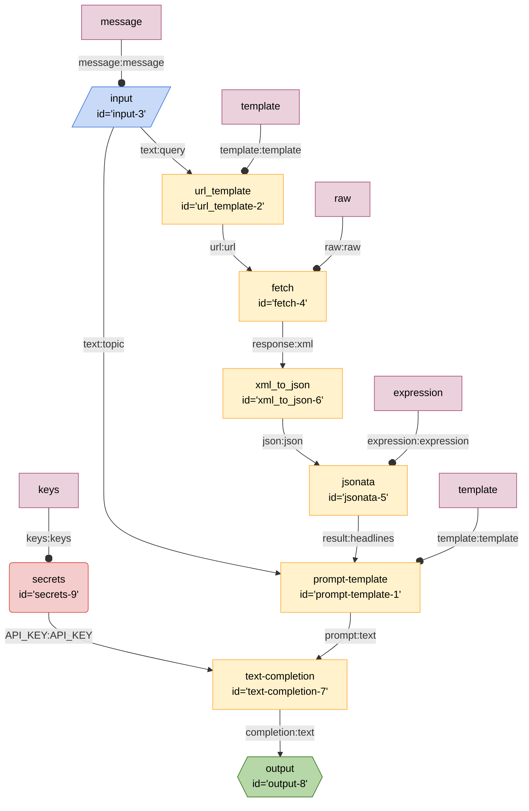

# Google News Diagram

```mermaid
%%{init: 'themeVariables': { 'fontFamily': 'Fira Code, monospace' }}%%
graph TD;
input3[/"input
id='input-3'"/]:::input -- text:topic --> prompttemplate1["prompt-template
id='prompt-template-1'"]
input3[/"input
id='input-3'"/]:::input -- text:query --> url_template2["url_template
id='url_template-2'"]
url_template2["url_template
id='url_template-2'"] -- url:url --> fetch4["fetch
id='fetch-4'"]
jsonata5["jsonata
id='jsonata-5'"] -- result:headlines --> prompttemplate1["prompt-template
id='prompt-template-1'"]
xml_to_json6["xml_to_json
id='xml_to_json-6'"] -- json:json --> jsonata5["jsonata
id='jsonata-5'"]
fetch4["fetch
id='fetch-4'"] -- response:xml --> xml_to_json6["xml_to_json
id='xml_to_json-6'"]
textcompletion7["text-completion
id='text-completion-7'"] -- completion:text --> output8{{"output
id='output-8'"}}:::output
secrets9("secrets
id='secrets-9'"):::secrets -- API_KEY:API_KEY --> textcompletion7["text-completion
id='text-completion-7'"]
prompttemplate1["prompt-template
id='prompt-template-1'"] -- prompt:text --> textcompletion7["text-completion
id='text-completion-7'"]
templateprompttemplate1[template]:::config -- template:template --o prompttemplate1
templateurl_template2[template]:::config -- template:template --o url_template2
messageinput3[message]:::config -- message:message --o input3
rawfetch4[raw]:::config -- raw:raw --o fetch4
expressionjsonata5[expression]:::config -- expression:expression --o jsonata5
keyssecrets9[keys]:::config -- keys:keys --o secrets9
classDef default stroke:#ffab40,fill:#fff2ccff,color:#000
classDef input stroke:#3c78d8,fill:#c9daf8ff,color:#000
classDef output stroke:#38761d,fill:#b6d7a8ff,color:#000
classDef passthrough stroke:#a64d79,fill:#ead1dcff,color:#000
classDef slot stroke:#a64d79,fill:#ead1dcff,color:#000
classDef config stroke:#a64d79,fill:#ead1dcff,color:#000
classDef secrets stroke:#db4437,fill:#f4cccc,color:#000
classDef slotted stroke:#a64d79
```