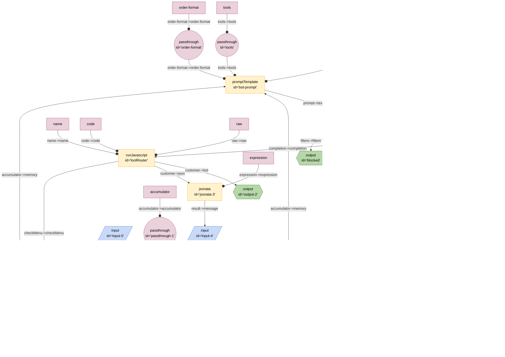

# Coffee Bot

```mermaid
%%{init: 'themeVariables': { 'fontFamily': 'Fira Code, monospace' }}%%
graph TD;
tools(("passthrough <br> id='tools'")):::passthrough -- "tools->tools" --o botprompt["promptTemplate <br> id='bot-prompt'"]
orderformat(("passthrough <br> id='order-format'")):::passthrough -- "order-format->order-format" --o botprompt["promptTemplate <br> id='bot-prompt'"]
passthrough1(("passthrough <br> id='passthrough-1'")):::passthrough -- "accumulator->accumulator" --> customerMemory["append <br> id='customerMemory'"]
customerMemory["append <br> id='customerMemory'"] -- "accumulator->accumulator" --> agentMemory["append <br> id='agentMemory'"]
agentMemory["append <br> id='agentMemory'"] -- "accumulator->accumulator" --> toolMemory["append <br> id='toolMemory'"]
agentMemory["append <br> id='agentMemory'"] -- "accumulator->accumulator" --> customerMemory["append <br> id='customerMemory'"]
toolMemory["append <br> id='toolMemory'"] -- "accumulator->accumulator" --> agentMemory["append <br> id='agentMemory'"]
customerMemory["append <br> id='customerMemory'"] -- "accumulator->memory" --> botprompt["promptTemplate <br> id='bot-prompt'"]
toolMemory["append <br> id='toolMemory'"] -- "accumulator->memory" --> botprompt["promptTemplate <br> id='bot-prompt'"]
checkMenu["runJavascript <br> id='checkMenu'"] -- "result->Tool" --> toolMemory["append <br> id='toolMemory'"]
toolRouter["runJavascript <br> id='toolRouter'"] -- "customer->bot" --> output2{{"output <br> id='output-2'"}}:::output
input4[/"input <br> id='input-4'"/]:::input -- "customer->Customer" --> customerMemory["append <br> id='customerMemory'"]
jsonata3["jsonata <br> id='jsonata-3'"] -- "result->message" --> input4[/"input <br> id='input-4'"/]:::input
toolRouter["runJavascript <br> id='toolRouter'"] -- "customer->json" --> jsonata3["jsonata <br> id='jsonata-3'"]
toolRouter["runJavascript <br> id='toolRouter'"] -- "checkMenu->checkMenu" --> checkMenu["runJavascript <br> id='checkMenu'"]
input5[/"input <br> id='input-5'"/]:::input -- "customer->Customer" --> customerMemory["append <br> id='customerMemory'"]
generateText6["generateText <br> id='generateText-6'"] -- "completion->completion" --> toolRouter["runJavascript <br> id='toolRouter'"]
generateText6["generateText <br> id='generateText-6'"] -- "completion->Agent" --> agentMemory["append <br> id='agentMemory'"]
generateText6["generateText <br> id='generateText-6'"] -- "filters->filters" --> blocked{{"output <br> id='blocked'"}}:::output
secrets7("secrets <br> id='secrets-7'"):::secrets -- "PALM_KEY->PALM_KEY" --o generateText6["generateText <br> id='generateText-6'"]
botprompt["promptTemplate <br> id='bot-prompt'"] -- "prompt->text" --> generateText6["generateText <br> id='generateText-6'"]
templatebotprompt[template]:::config -- "template->template" --o botprompt
toolstools[tools]:::config -- "tools->tools" --o tools
orderformatorderformat[order-format]:::config -- "order-format->order-format" --o orderformat
accumulatorpassthrough1[accumulator]:::config -- "accumulator->accumulator" --o passthrough1
namecheckMenu[name]:::config -- "name->name" --o checkMenu
codecheckMenu[code]:::config -- "code->code" --o checkMenu
nametoolRouter[name]:::config -- "name->name" --o toolRouter
codetoolRouter[code]:::config -- "code->code" --o toolRouter
rawtoolRouter[raw]:::config -- "raw->raw" --o toolRouter
expressionjsonata3[expression]:::config -- "expression->expression" --o jsonata3
stopSequencesgenerateText6[stopSequences]:::config -- "stopSequences->stopSequences" --o generateText6
safetySettingsgenerateText6[safetySettings]:::config -- "safetySettings->safetySettings" --o generateText6
keyssecrets7[keys]:::config -- "keys->keys" --o secrets7
classDef default stroke:#ffab40,fill:#fff2ccff,color:#000
classDef input stroke:#3c78d8,fill:#c9daf8ff,color:#000
classDef output stroke:#38761d,fill:#b6d7a8ff,color:#000
classDef passthrough stroke:#a64d79,fill:#ead1dcff,color:#000
classDef slot stroke:#a64d79,fill:#ead1dcff,color:#000
classDef config stroke:#a64d79,fill:#ead1dcff,color:#000
classDef secrets stroke:#db4437,fill:#f4cccc,color:#000
classDef slotted stroke:#a64d79
```