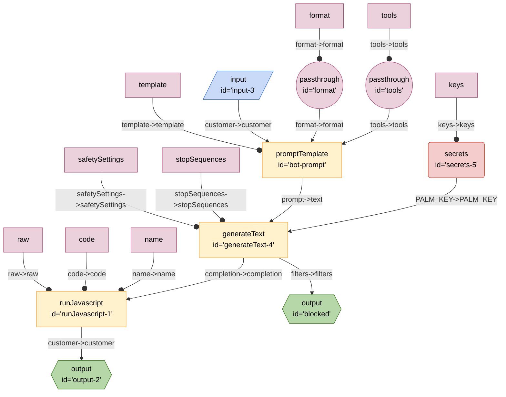

# Coffee Bot

```mermaid
%%{init: 'themeVariables': { 'fontFamily': 'Fira Code, monospace' }}%%
graph TD;
tools(("passthrough <br> id='tools'")):::passthrough -- "tools->tools" --> botprompt["promptTemplate <br> id='bot-prompt'"]
format(("passthrough <br> id='format'")):::passthrough -- "format->format" --> botprompt["promptTemplate <br> id='bot-prompt'"]
runJavascript1["runJavascript <br> id='runJavascript-1'"] -- "customer->customer" --> output2{{"output <br> id='output-2'"}}:::output
generateText4["generateText <br> id='generateText-4'"] -- "completion->completion" --> runJavascript1["runJavascript <br> id='runJavascript-1'"]
generateText4["generateText <br> id='generateText-4'"] -- "filters->filters" --> blocked{{"output <br> id='blocked'"}}:::output
secrets5("secrets <br> id='secrets-5'"):::secrets -- "PALM_KEY->PALM_KEY" --> generateText4["generateText <br> id='generateText-4'"]
botprompt["promptTemplate <br> id='bot-prompt'"] -- "prompt->text" --> generateText4["generateText <br> id='generateText-4'"]
input3[/"input <br> id='input-3'"/]:::input -- "customer->customer" --> botprompt["promptTemplate <br> id='bot-prompt'"]
templatebotprompt[template]:::config -- "template->template" --o botprompt
toolstools[tools]:::config -- "tools->tools" --o tools
formatformat[format]:::config -- "format->format" --o format
namerunJavascript1[name]:::config -- "name->name" --o runJavascript1
coderunJavascript1[code]:::config -- "code->code" --o runJavascript1
rawrunJavascript1[raw]:::config -- "raw->raw" --o runJavascript1
stopSequencesgenerateText4[stopSequences]:::config -- "stopSequences->stopSequences" --o generateText4
safetySettingsgenerateText4[safetySettings]:::config -- "safetySettings->safetySettings" --o generateText4
keyssecrets5[keys]:::config -- "keys->keys" --o secrets5
classDef default stroke:#ffab40,fill:#fff2ccff,color:#000
classDef input stroke:#3c78d8,fill:#c9daf8ff,color:#000
classDef output stroke:#38761d,fill:#b6d7a8ff,color:#000
classDef passthrough stroke:#a64d79,fill:#ead1dcff,color:#000
classDef slot stroke:#a64d79,fill:#ead1dcff,color:#000
classDef config stroke:#a64d79,fill:#ead1dcff,color:#000
classDef secrets stroke:#db4437,fill:#f4cccc,color:#000
classDef slotted stroke:#a64d79
```