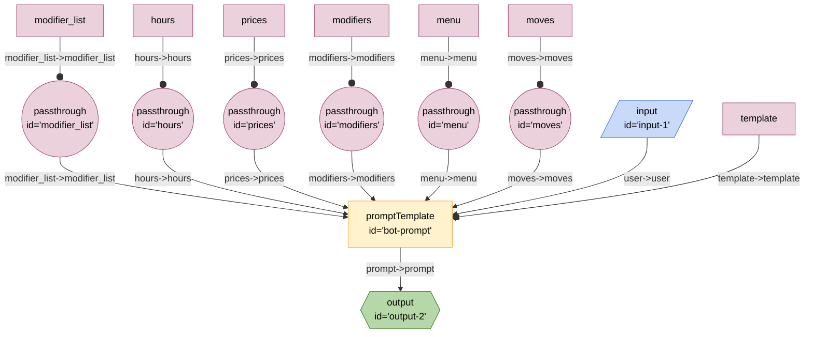

# Coffee Bot

```mermaid
%%{init: 'themeVariables': { 'fontFamily': 'Fira Code, monospace' }}%%
graph TD;
modifier_list(("passthrough <br> id='modifier_list'")):::passthrough -- "modifier_list->modifier_list" --> botprompt["promptTemplate <br> id='bot-prompt'"]
hours(("passthrough <br> id='hours'")):::passthrough -- "hours->hours" --> botprompt["promptTemplate <br> id='bot-prompt'"]
prices(("passthrough <br> id='prices'")):::passthrough -- "prices->prices" --> botprompt["promptTemplate <br> id='bot-prompt'"]
modifiers(("passthrough <br> id='modifiers'")):::passthrough -- "modifiers->modifiers" --> botprompt["promptTemplate <br> id='bot-prompt'"]
menu(("passthrough <br> id='menu'")):::passthrough -- "menu->menu" --> botprompt["promptTemplate <br> id='bot-prompt'"]
moves(("passthrough <br> id='moves'")):::passthrough -- "moves->moves" --> botprompt["promptTemplate <br> id='bot-prompt'"]
botprompt["promptTemplate <br> id='bot-prompt'"] -- "prompt->prompt" --> output2{{"output <br> id='output-2'"}}:::output
input1[/"input <br> id='input-1'"/]:::input -- "user->user" --> botprompt["promptTemplate <br> id='bot-prompt'"]
templatebotprompt[template]:::config -- "template->template" --o botprompt
modifier_listmodifier_list[modifier_list]:::config -- "modifier_list->modifier_list" --o modifier_list
hourshours[hours]:::config -- "hours->hours" --o hours
pricesprices[prices]:::config -- "prices->prices" --o prices
modifiersmodifiers[modifiers]:::config -- "modifiers->modifiers" --o modifiers
menumenu[menu]:::config -- "menu->menu" --o menu
movesmoves[moves]:::config -- "moves->moves" --o moves
classDef default stroke:#ffab40,fill:#fff2ccff,color:#000
classDef input stroke:#3c78d8,fill:#c9daf8ff,color:#000
classDef output stroke:#38761d,fill:#b6d7a8ff,color:#000
classDef passthrough stroke:#a64d79,fill:#ead1dcff,color:#000
classDef slot stroke:#a64d79,fill:#ead1dcff,color:#000
classDef config stroke:#a64d79,fill:#ead1dcff,color:#000
classDef secrets stroke:#db4437,fill:#f4cccc,color:#000
classDef slotted stroke:#a64d79
```