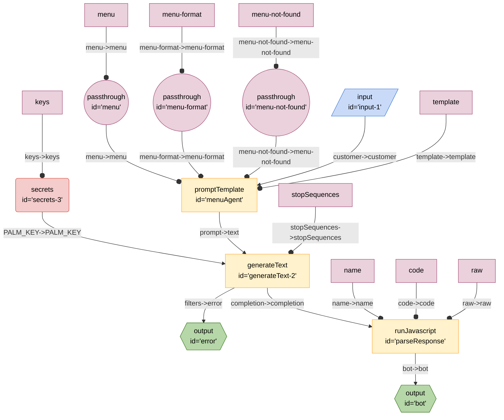

# Coffee Bot

```mermaid
%%{init: 'themeVariables': { 'fontFamily': 'Fira Code, monospace' }}%%
graph TD;
menu(("passthrough <br> id='menu'")):::passthrough -- "menu->menu" --o menuAgent["promptTemplate <br> id='menuAgent'"]
menuformat(("passthrough <br> id='menu-format'")):::passthrough -- "menu-format->menu-format" --o menuAgent["promptTemplate <br> id='menuAgent'"]
menunotfound(("passthrough <br> id='menu-not-found'")):::passthrough -- "menu-not-found->menu-not-found" --o menuAgent["promptTemplate <br> id='menuAgent'"]
generateText2["generateText <br> id='generateText-2'"] -- "filters->error" --> error{{"output <br> id='error'"}}:::output
secrets3("secrets <br> id='secrets-3'"):::secrets -- "PALM_KEY->PALM_KEY" --> generateText2["generateText <br> id='generateText-2'"]
parseResponse["runJavascript <br> id='parseResponse'"] -- "bot->bot" --> bot{{"output <br> id='bot'"}}:::output
generateText2["generateText <br> id='generateText-2'"] -- "completion->completion" --> parseResponse["runJavascript <br> id='parseResponse'"]
menuAgent["promptTemplate <br> id='menuAgent'"] -- "prompt->text" --> generateText2["generateText <br> id='generateText-2'"]
input1[/"input <br> id='input-1'"/]:::input -- "customer->customer" --> menuAgent["promptTemplate <br> id='menuAgent'"]
templatemenuAgent[template]:::config -- "template->template" --o menuAgent
menumenu[menu]:::config -- "menu->menu" --o menu
menuformatmenuformat[menu-format]:::config -- "menu-format->menu-format" --o menuformat
menunotfoundmenunotfound[menu-not-found]:::config -- "menu-not-found->menu-not-found" --o menunotfound
stopSequencesgenerateText2[stopSequences]:::config -- "stopSequences->stopSequences" --o generateText2
keyssecrets3[keys]:::config -- "keys->keys" --o secrets3
nameparseResponse[name]:::config -- "name->name" --o parseResponse
codeparseResponse[code]:::config -- "code->code" --o parseResponse
rawparseResponse[raw]:::config -- "raw->raw" --o parseResponse
classDef default stroke:#ffab40,fill:#fff2ccff,color:#000
classDef input stroke:#3c78d8,fill:#c9daf8ff,color:#000
classDef output stroke:#38761d,fill:#b6d7a8ff,color:#000
classDef passthrough stroke:#a64d79,fill:#ead1dcff,color:#000
classDef slot stroke:#a64d79,fill:#ead1dcff,color:#000
classDef config stroke:#a64d79,fill:#ead1dcff,color:#000
classDef secrets stroke:#db4437,fill:#f4cccc,color:#000
classDef slotted stroke:#a64d79
```