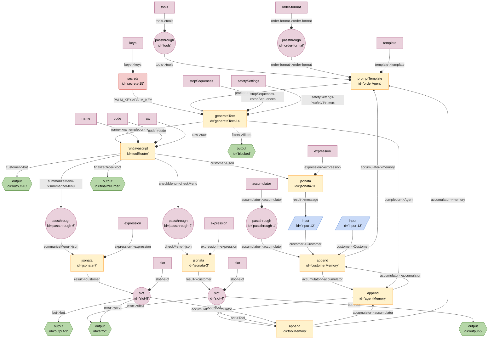

# Coffee Bot

```mermaid
%%{init: 'themeVariables': { 'fontFamily': 'Fira Code, monospace' }}%%
graph TD;
tools(("passthrough <br> id='tools'")):::passthrough -- "tools->tools" --o orderAgent["promptTemplate <br> id='orderAgent'"]
orderformat(("passthrough <br> id='order-format'")):::passthrough -- "order-format->order-format" --o orderAgent["promptTemplate <br> id='orderAgent'"]
passthrough1(("passthrough <br> id='passthrough-1'")):::passthrough -- "accumulator->accumulator" --> customerMemory["append <br> id='customerMemory'"]
customerMemory["append <br> id='customerMemory'"] -- "accumulator->accumulator" --> agentMemory["append <br> id='agentMemory'"]
agentMemory["append <br> id='agentMemory'"] -- "accumulator->accumulator" --> toolMemory["append <br> id='toolMemory'"]
agentMemory["append <br> id='agentMemory'"] -- "accumulator->accumulator" --> customerMemory["append <br> id='customerMemory'"]
toolMemory["append <br> id='toolMemory'"] -- "accumulator->accumulator" --> agentMemory["append <br> id='agentMemory'"]
customerMemory["append <br> id='customerMemory'"] -- "accumulator->memory" --> orderAgent["promptTemplate <br> id='orderAgent'"]
toolMemory["append <br> id='toolMemory'"] -- "accumulator->memory" --> orderAgent["promptTemplate <br> id='orderAgent'"]
slot4(("slot <br> id='slot-4'")):::slot -- "bot->Tool" --> toolMemory["append <br> id='toolMemory'"]
slot4(("slot <br> id='slot-4'")):::slot -- "bot->bot" --> output5{{"output <br> id='output-5'"}}:::output
slot4(("slot <br> id='slot-4'")):::slot -- "error->error" --> error{{"output <br> id='error'"}}:::output
jsonata3["jsonata <br> id='jsonata-3'"] -- "result->customer" --> slot4(("slot <br> id='slot-4'")):::slot
passthrough2(("passthrough <br> id='passthrough-2'")):::passthrough -- "checkMenu->json" --> jsonata3["jsonata <br> id='jsonata-3'"]
slot8(("slot <br> id='slot-8'")):::slot -- "bot->Tool" --> toolMemory["append <br> id='toolMemory'"]
slot8(("slot <br> id='slot-8'")):::slot -- "bot->bot" --> output9{{"output <br> id='output-9'"}}:::output
slot8(("slot <br> id='slot-8'")):::slot -- "error->error" --> error{{"output <br> id='error'"}}:::output
jsonata7["jsonata <br> id='jsonata-7'"] -- "result->customer" --> slot8(("slot <br> id='slot-8'")):::slot
passthrough6(("passthrough <br> id='passthrough-6'")):::passthrough -- "summarizeMenu->json" --> jsonata7["jsonata <br> id='jsonata-7'"]
toolRouter["runJavascript <br> id='toolRouter'"] -- "customer->bot" --> output10{{"output <br> id='output-10'"}}:::output
input12[/"input <br> id='input-12'"/]:::input -- "customer->Customer" --> customerMemory["append <br> id='customerMemory'"]
jsonata11["jsonata <br> id='jsonata-11'"] -- "result->message" --> input12[/"input <br> id='input-12'"/]:::input
toolRouter["runJavascript <br> id='toolRouter'"] -- "customer->json" --> jsonata11["jsonata <br> id='jsonata-11'"]
toolRouter["runJavascript <br> id='toolRouter'"] -- "checkMenu->checkMenu" --> passthrough2(("passthrough <br> id='passthrough-2'")):::passthrough
toolRouter["runJavascript <br> id='toolRouter'"] -- "summarizeMenu->summarizeMenu" --> passthrough6(("passthrough <br> id='passthrough-6'")):::passthrough
toolRouter["runJavascript <br> id='toolRouter'"] -- "finalizeOrder->bot" --> finalizeOrder{{"output <br> id='finalizeOrder'"}}:::output
input13[/"input <br> id='input-13'"/]:::input -- "customer->Customer" --> customerMemory["append <br> id='customerMemory'"]
generateText14["generateText <br> id='generateText-14'"] -- "completion->completion" --> toolRouter["runJavascript <br> id='toolRouter'"]
generateText14["generateText <br> id='generateText-14'"] -- "completion->Agent" --> agentMemory["append <br> id='agentMemory'"]
generateText14["generateText <br> id='generateText-14'"] -- "filters->filters" --> blocked{{"output <br> id='blocked'"}}:::output
secrets15("secrets <br> id='secrets-15'"):::secrets -- "PALM_KEY->PALM_KEY" --o generateText14["generateText <br> id='generateText-14'"]
orderAgent["promptTemplate <br> id='orderAgent'"] -- "prompt->text" --> generateText14["generateText <br> id='generateText-14'"]
templateorderAgent[template]:::config -- "template->template" --o orderAgent
toolstools[tools]:::config -- "tools->tools" --o tools
orderformatorderformat[order-format]:::config -- "order-format->order-format" --o orderformat
accumulatorpassthrough1[accumulator]:::config -- "accumulator->accumulator" --o passthrough1
expressionjsonata3[expression]:::config -- "expression->expression" --o jsonata3
slotslot4[slot]:::config -- "slot->slot" --o slot4
expressionjsonata7[expression]:::config -- "expression->expression" --o jsonata7
slotslot8[slot]:::config -- "slot->slot" --o slot8
nametoolRouter[name]:::config -- "name->name" --o toolRouter
codetoolRouter[code]:::config -- "code->code" --o toolRouter
rawtoolRouter[raw]:::config -- "raw->raw" --o toolRouter
expressionjsonata11[expression]:::config -- "expression->expression" --o jsonata11
stopSequencesgenerateText14[stopSequences]:::config -- "stopSequences->stopSequences" --o generateText14
safetySettingsgenerateText14[safetySettings]:::config -- "safetySettings->safetySettings" --o generateText14
keyssecrets15[keys]:::config -- "keys->keys" --o secrets15
classDef default stroke:#ffab40,fill:#fff2ccff,color:#000
classDef input stroke:#3c78d8,fill:#c9daf8ff,color:#000
classDef output stroke:#38761d,fill:#b6d7a8ff,color:#000
classDef passthrough stroke:#a64d79,fill:#ead1dcff,color:#000
classDef slot stroke:#a64d79,fill:#ead1dcff,color:#000
classDef config stroke:#a64d79,fill:#ead1dcff,color:#000
classDef secrets stroke:#db4437,fill:#f4cccc,color:#000
classDef slotted stroke:#a64d79
```