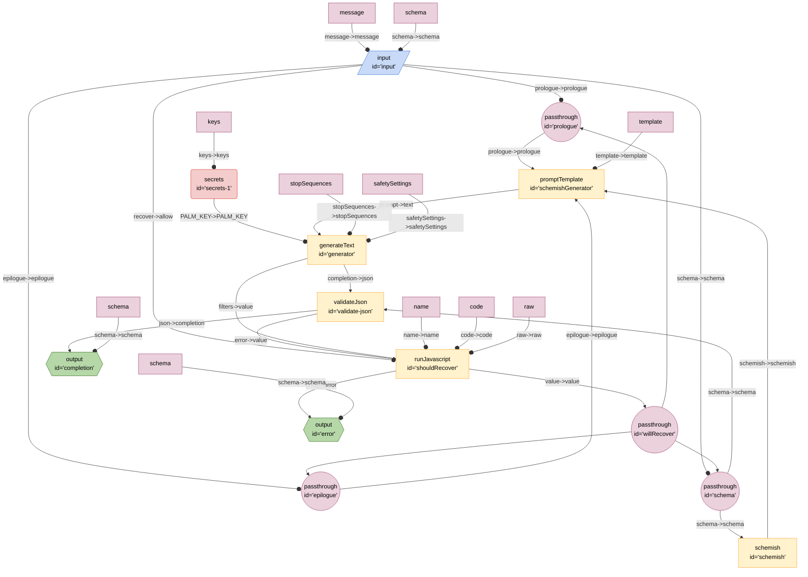

# Coffee Bot graph for schemish-generator.json

```mermaid
%%{init: 'themeVariables': { 'fontFamily': 'Fira Code, monospace' }}%%
graph TD;
input[/"input <br> id='input'"/]:::input -- "prologue->prologue" --o prologue(("passthrough <br> id='prologue'")):::passthrough
input[/"input <br> id='input'"/]:::input -- "epilogue->epilogue" --o epilogue(("passthrough <br> id='epilogue'")):::passthrough
input[/"input <br> id='input'"/]:::input -- "schema->schema" --o schema(("passthrough <br> id='schema'")):::passthrough
input[/"input <br> id='input'"/]:::input -- "recover->allow" --o shouldRecover["runJavascript <br> id='shouldRecover'"]
shouldRecover["runJavascript <br> id='shouldRecover'"] -- "value->value" --> willRecover(("passthrough <br> id='willRecover'")):::passthrough
shouldRecover["runJavascript <br> id='shouldRecover'"] -- "error->error" --> error{{"output <br> id='error'"}}:::output
willRecover(("passthrough <br> id='willRecover'")):::passthrough --> prologue(("passthrough <br> id='prologue'")):::passthrough
willRecover(("passthrough <br> id='willRecover'")):::passthrough --> epilogue(("passthrough <br> id='epilogue'")):::passthrough
willRecover(("passthrough <br> id='willRecover'")):::passthrough --> schema(("passthrough <br> id='schema'")):::passthrough
schema(("passthrough <br> id='schema'")):::passthrough -- "schema->schema" --> schemish["schemish <br> id='schemish'"]
schema(("passthrough <br> id='schema'")):::passthrough -- "schema->schema" --> validatejson["validateJson <br> id='validate-json'"]
validatejson["validateJson <br> id='validate-json'"] -- "json->completion" --> completion{{"output <br> id='completion'"}}:::output
validatejson["validateJson <br> id='validate-json'"] -- "error->value" --> shouldRecover["runJavascript <br> id='shouldRecover'"]
secrets1("secrets <br> id='secrets-1'"):::secrets -- "PALM_KEY->PALM_KEY" --o generator["generateText <br> id='generator'"]
generator["generateText <br> id='generator'"] -- "completion->json" --> validatejson["validateJson <br> id='validate-json'"]
generator["generateText <br> id='generator'"] -- "filters->value" --> shouldRecover["runJavascript <br> id='shouldRecover'"]
prologue(("passthrough <br> id='prologue'")):::passthrough -- "prologue->prologue" --> schemishGenerator["promptTemplate <br> id='schemishGenerator'"]
epilogue(("passthrough <br> id='epilogue'")):::passthrough -- "epilogue->epilogue" --> schemishGenerator["promptTemplate <br> id='schemishGenerator'"]
schemish["schemish <br> id='schemish'"] -- "schemish->schemish" --> schemishGenerator["promptTemplate <br> id='schemishGenerator'"]
schemishGenerator["promptTemplate <br> id='schemishGenerator'"] -- "prompt->text" --> generator["generateText <br> id='generator'"]
nameshouldRecover[name]:::config -- "name->name" --o shouldRecover
codeshouldRecover[code]:::config -- "code->code" --o shouldRecover
rawshouldRecover[raw]:::config -- "raw->raw" --o shouldRecover
schemaerror[schema]:::config -- "schema->schema" --o error
schemacompletion[schema]:::config -- "schema->schema" --o completion
messageinput[message]:::config -- "message->message" --o input
schemainput[schema]:::config -- "schema->schema" --o input
stopSequencesgenerator[stopSequences]:::config -- "stopSequences->stopSequences" --o generator
safetySettingsgenerator[safetySettings]:::config -- "safetySettings->safetySettings" --o generator
keyssecrets1[keys]:::config -- "keys->keys" --o secrets1
templateschemishGenerator[template]:::config -- "template->template" --o schemishGenerator
classDef default stroke:#ffab40,fill:#fff2ccff,color:#000
classDef input stroke:#3c78d8,fill:#c9daf8ff,color:#000
classDef output stroke:#38761d,fill:#b6d7a8ff,color:#000
classDef passthrough stroke:#a64d79,fill:#ead1dcff,color:#000
classDef slot stroke:#a64d79,fill:#ead1dcff,color:#000
classDef config stroke:#a64d79,fill:#ead1dcff,color:#000
classDef secrets stroke:#db4437,fill:#f4cccc,color:#000
classDef slotted stroke:#a64d79
```