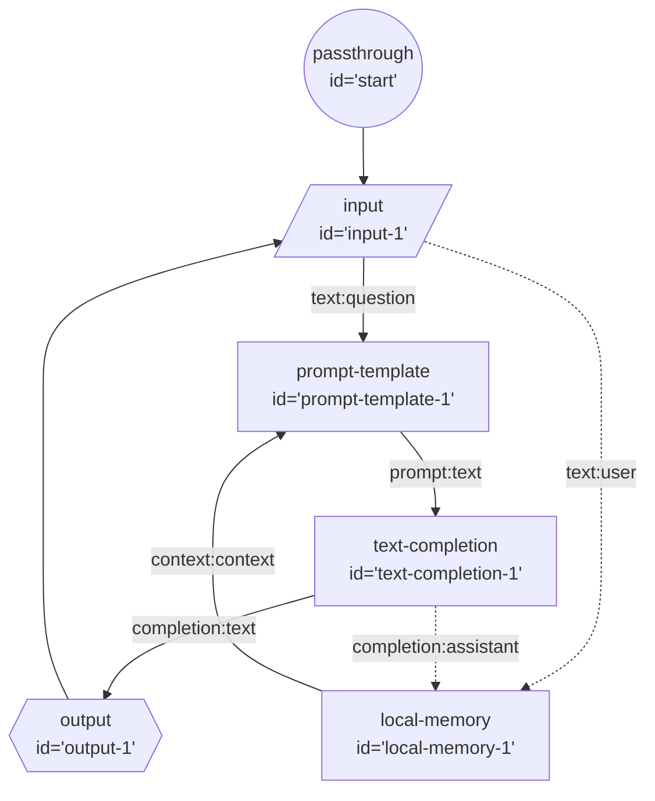

# accumulating-context
---

```mermaid
graph TD;
start(("passthrough
id='start'")):::passthrough --> input-1[/"input
id='input-1'"/]:::input
input-1[/"input
id='input-1'"/]:::input -- text:question --> prompt-template-1["prompt-template
id='prompt-template-1'"]
prompt-template-1["prompt-template
id='prompt-template-1'"] -- prompt:text --> text-completion-1["text-completion
id='text-completion-1'"]
text-completion-1["text-completion
id='text-completion-1'"] -- completion:text --> output-1{{"output
id='output-1'"}}:::output
input-1[/"input
id='input-1'"/]:::input -. text:user .-> local-memory-1["local-memory
id='local-memory-1'"]
text-completion-1["text-completion
id='text-completion-1'"] -. completion:assistant .-> local-memory-1["local-memory
id='local-memory-1'"]
output-1{{"output
id='output-1'"}}:::output --> input-1[/"input
id='input-1'"/]:::input
local-memory-1["local-memory
id='local-memory-1'"] -- context:context --> prompt-template-1["prompt-template
id='prompt-template-1'"]
```