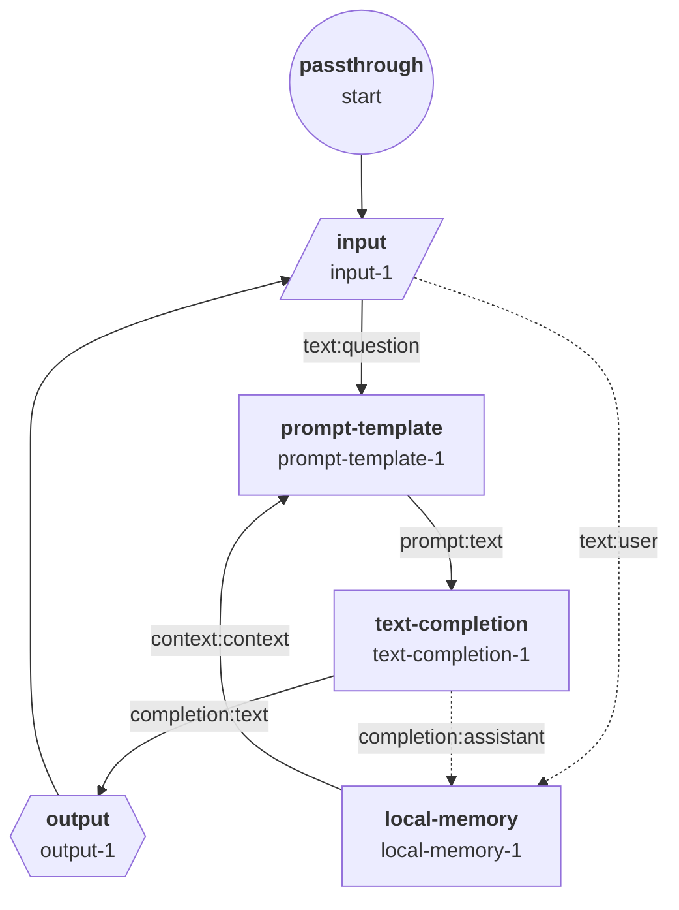

# accumulating-context
---

```mermaid
graph TD;
start(("`**passthrough**
start`")):::passthrough --> input-1[/"`**input**
input-1`"/]:::input
input-1[/"`**input**
input-1`"/]:::input -- text:question --> prompt-template-1["`**prompt-template**
prompt-template-1`"]
prompt-template-1["`**prompt-template**
prompt-template-1`"] -- prompt:text --> text-completion-1["`**text-completion**
text-completion-1`"]
text-completion-1["`**text-completion**
text-completion-1`"] -- completion:text --> output-1{{"`**output**
output-1`"}}:::output
input-1[/"`**input**
input-1`"/]:::input -. text:user .-> local-memory-1["`**local-memory**
local-memory-1`"]
text-completion-1["`**text-completion**
text-completion-1`"] -. completion:assistant .-> local-memory-1["`**local-memory**
local-memory-1`"]
output-1{{"`**output**
output-1`"}}:::output --> input-1[/"`**input**
input-1`"/]:::input
local-memory-1["`**local-memory**
local-memory-1`"] -- context:context --> prompt-template-1["`**prompt-template**
prompt-template-1`"]
```