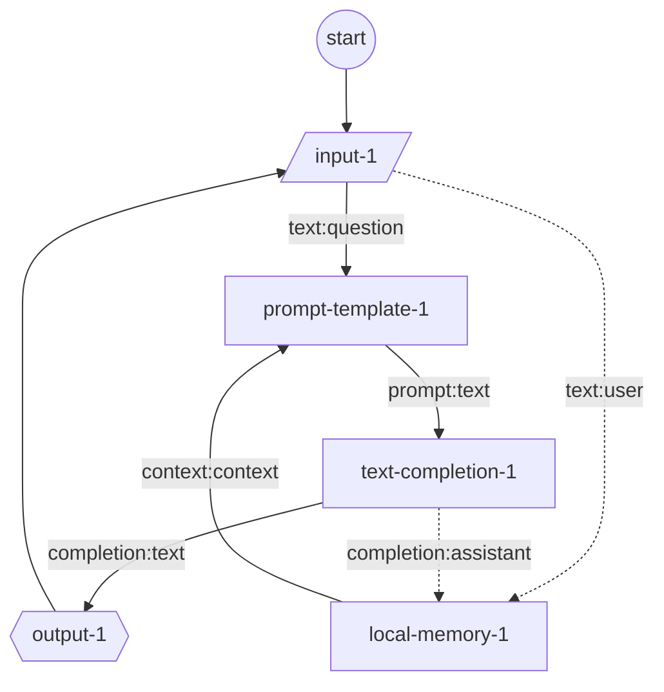

# accumulating-context
---

```mermaid
graph TD;
start((start)) --> input-1[/input-1/]
input-1[/input-1/] -- text:question --> prompt-template-1
prompt-template-1 -- prompt:text --> text-completion-1
text-completion-1 -- completion:text --> output-1{{output-1}}
input-1[/input-1/] -. text:user .-> local-memory-1
text-completion-1 -. completion:assistant .-> local-memory-1
output-1{{output-1}} --> input-1[/input-1/]
local-memory-1 -- context:context --> prompt-template-1
```