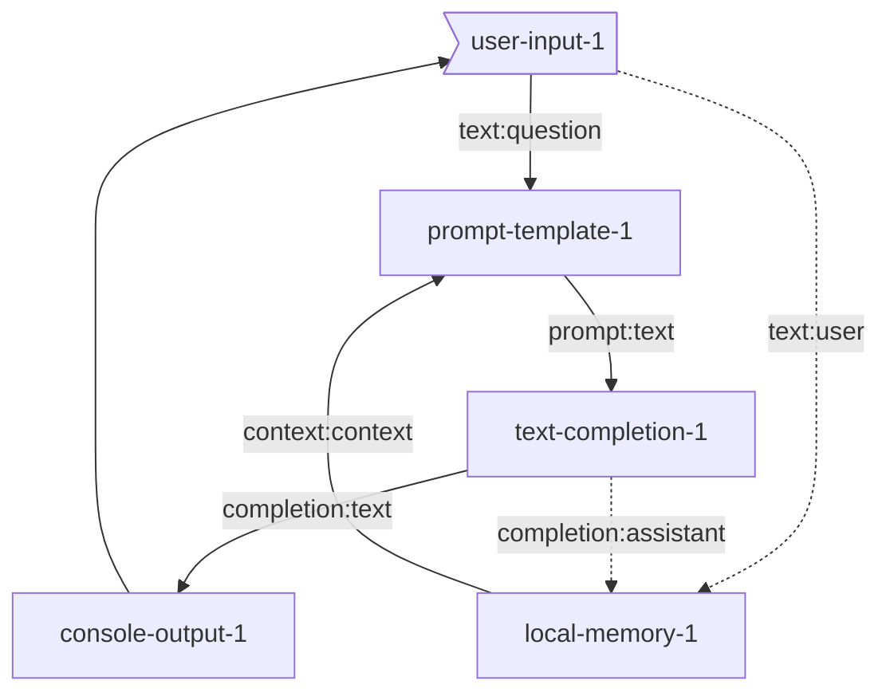

# accumulating-context
---

```mermaid
graph TD;
user-input-1>user-input-1] -- text:question --> prompt-template-1
prompt-template-1 -- prompt:text --> text-completion-1
text-completion-1 -- completion:text --> console-output-1
user-input-1 -. text:user .-> local-memory-1
text-completion-1 -. completion:assistant .-> local-memory-1
console-output-1 --> user-input-1
local-memory-1 -- context:context --> prompt-template-1
```