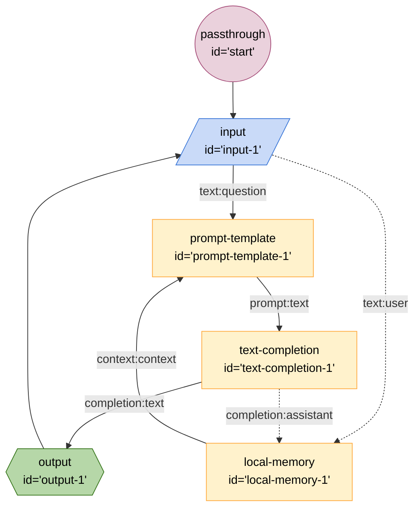

# accumulating-context
---

```mermaid
%%{init: 'themeVariables': { 'fontFamily': 'Fira Code, monospace' }}}%%
graph TD;
start(("passthrough
id='start'")):::passthrough --> input1[/"input
id='input-1'"/]:::input
input1[/"input
id='input-1'"/]:::input -- text:question --> prompttemplate1["prompt-template
id='prompt-template-1'"]
prompttemplate1["prompt-template
id='prompt-template-1'"] -- prompt:text --> textcompletion1["text-completion
id='text-completion-1'"]
textcompletion1["text-completion
id='text-completion-1'"] -- completion:text --> output1{{"output
id='output-1'"}}:::output
input1[/"input
id='input-1'"/]:::input -. text:user .-> localmemory1["local-memory
id='local-memory-1'"]
textcompletion1["text-completion
id='text-completion-1'"] -. completion:assistant .-> localmemory1["local-memory
id='local-memory-1'"]
output1{{"output
id='output-1'"}}:::output --> input1[/"input
id='input-1'"/]:::input
localmemory1["local-memory
id='local-memory-1'"] -- context:context --> prompttemplate1["prompt-template
id='prompt-template-1'"]
classDef default stroke:#ffab40,fill:#fff2ccff,color:#000
classDef input stroke:#3c78d8,fill:#c9daf8ff,color:#000
classDef output stroke:#38761d,fill:#b6d7a8ff,color:#000
classDef passthrough stroke:#a64d79,fill:#ead1dcff,color:#000
classDef slot stroke:#a64d79,fill:#ead1dcff,color:#000
classDef slotted stroke:#a64d79
```