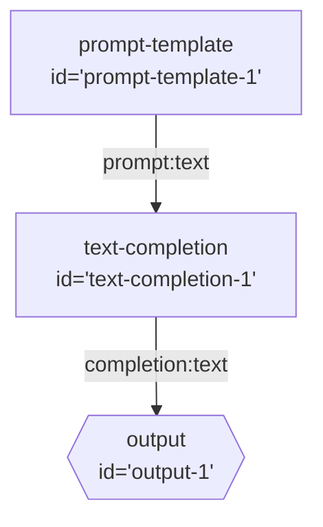

# auto-simple-prompt
---

```mermaid
graph TD;
prompt-template-1["prompt-template
id='prompt-template-1'"] -- prompt:text --> text-completion-1["text-completion
id='text-completion-1'"]
text-completion-1["text-completion
id='text-completion-1'"] -- completion:text --> output-1{{"output
id='output-1'"}}:::output
```