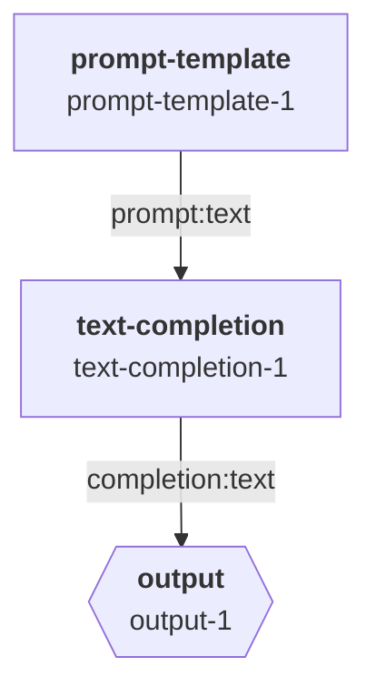

# auto-simple-prompt
---

```mermaid
graph TD;
prompt-template-1["`**prompt-template**
prompt-template-1`"] -- prompt:text --> text-completion-1["`**text-completion**
text-completion-1`"]
text-completion-1["`**text-completion**
text-completion-1`"] -- completion:text --> output-1{{"`**output**
output-1`"}}:::output
```