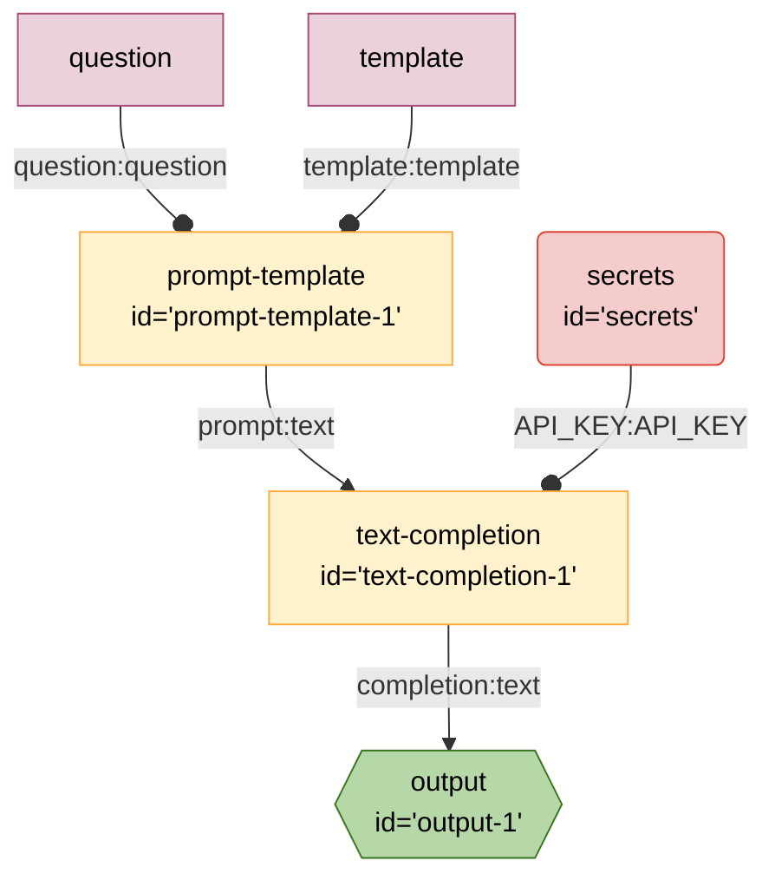

# auto-simple-prompt
---

```mermaid
%%{init: 'themeVariables': { 'fontFamily': 'Fira Code, monospace' }}%%
graph TD;
prompttemplate1["prompt-template
id='prompt-template-1'"] -- prompt:text --> textcompletion1["text-completion
id='text-completion-1'"]
secrets("secrets
id='secrets'"):::secrets -- API_KEY:API_KEY --o textcompletion1["text-completion
id='text-completion-1'"]
textcompletion1["text-completion
id='text-completion-1'"] -- completion:text --> output1{{"output
id='output-1'"}}:::output
questionprompttemplate1[question]:::config -- question:question --o prompttemplate1
templateprompttemplate1[template]:::config -- template:template --o prompttemplate1
classDef default stroke:#ffab40,fill:#fff2ccff,color:#000
classDef input stroke:#3c78d8,fill:#c9daf8ff,color:#000
classDef output stroke:#38761d,fill:#b6d7a8ff,color:#000
classDef passthrough stroke:#a64d79,fill:#ead1dcff,color:#000
classDef slot stroke:#a64d79,fill:#ead1dcff,color:#000
classDef config stroke:#a64d79,fill:#ead1dcff,color:#000
classDef secrets stroke:#db4437,fill:#f4cccc,color:#000
classDef slotted stroke:#a64d79
```