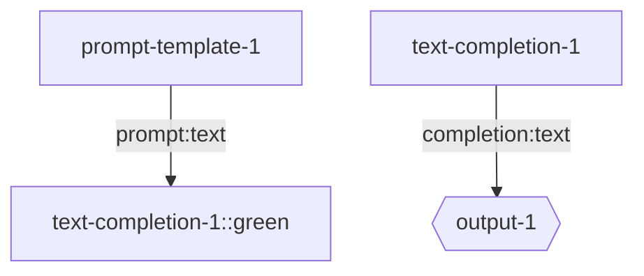

# auto-simple-prompt
---

```mermaid
graph TD;
prompt-template-1 -- prompt:text --> text-completion-1::green
text-completion-1 -- completion:text --> output-1{{output-1}}
classDef green fill:#cfc
```
