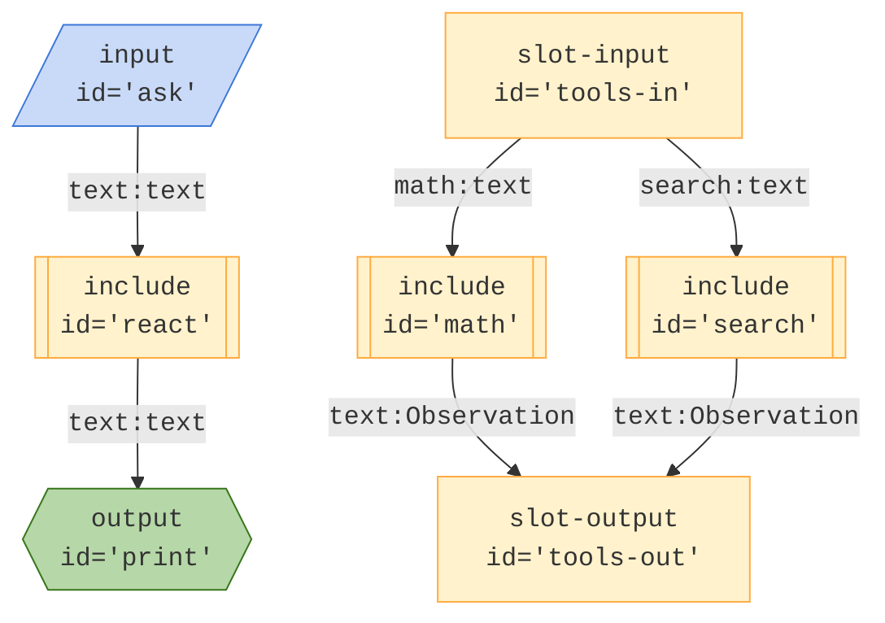

# call-react-with-slot
---

```mermaid
%%{init: {'theme':'default', 'themeVariables': { 'fontFamily': 'Fira Code, monospace', 'background': '#fff' }}}%%
graph TD;
ask[/"input
id='ask'"/]:::input -- text:text --> react[["include
id='react'"]]:::include
react[["include
id='react'"]]:::include -- text:text --> print{{"output
id='print'"}}:::output
tools-in["slot-input
id='tools-in'"] -- search:text --> search[["include
id='search'"]]:::include
tools-in["slot-input
id='tools-in'"] -- math:text --> math[["include
id='math'"]]:::include
math[["include
id='math'"]]:::include -- text:Observation --> tools-out["slot-output
id='tools-out'"]
search[["include
id='search'"]]:::include -- text:Observation --> tools-out["slot-output
id='tools-out'"]
classDef default stroke:#ffab40,fill:#fff2ccff
classDef input stroke:#3c78d8,fill:#c9daf8ff
classDef output stroke:#38761d,fill:#b6d7a8ff
classDef passthrough stroke:#a64d79,fill:#ead1dcff
```