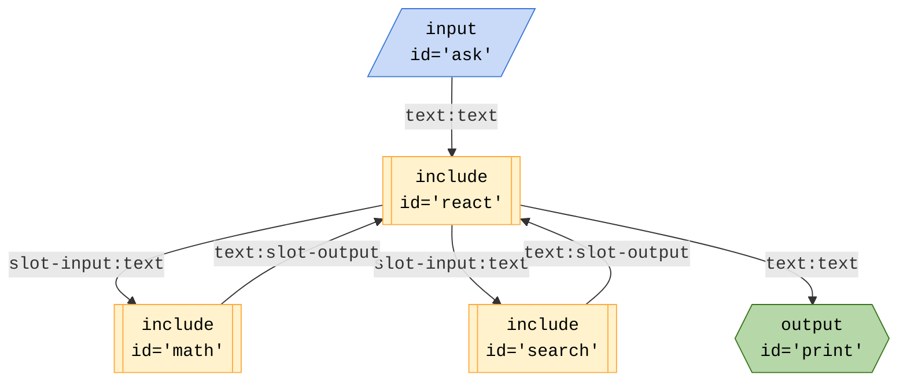

# call-react-with-slot
---

```mermaid
%%{init: {'themeVariables': { 'fontFamily': 'Fira Code, monospace' }}}%%
graph TD;
ask[/"input
id='ask'"/]:::input -- text:text --> react[["include
id='react'"]]:::include
react[["include
id='react'"]]:::include -- slot-input:text --> math[["include
id='math'"]]:::include
react[["include
id='react'"]]:::include -- slot-input:text --> search[["include
id='search'"]]:::include
search[["include
id='search'"]]:::include -- text:slot-output --> react[["include
id='react'"]]:::include
math[["include
id='math'"]]:::include -- text:slot-output --> react[["include
id='react'"]]:::include
react[["include
id='react'"]]:::include -- text:text --> print{{"output
id='print'"}}:::output
classDef default stroke:#ffab40,fill:#fff2ccff,color:#000
classDef input stroke:#3c78d8,fill:#c9daf8ff,color:#000
classDef output stroke:#38761d,fill:#b6d7a8ff,color:#000
classDef passthrough stroke:#a64d79,fill:#ead1dcff,color:#000
classDef slot stroke:#a64d79,fill:#ead1dcff,color:#000
```