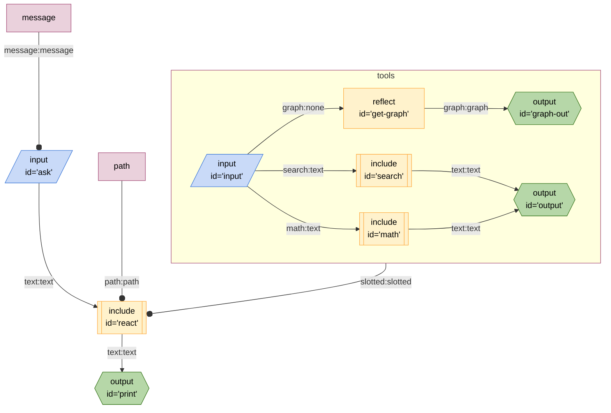

# call-react-with-slot
---

```mermaid
%%{init: 'themeVariables': { 'fontFamily': 'Fira Code, monospace' }}%%
graph TD;
ask[/"input
id='ask'"/]:::input -- text:text --> react[["include
id='react'"]]:::include
react[["include
id='react'"]]:::include -- text:text --> print{{"output
id='print'"}}:::output
subgraph tools
input[/"input
id='input'"/]:::input -- math:text --> math[["include
id='math'"]]:::include
input[/"input
id='input'"/]:::input -- graph:none --> getgraph["reflect
id='get-graph'"]
getgraph["reflect
id='get-graph'"] -- graph:graph --> graphout{{"output
id='graph-out'"}}:::output
input[/"input
id='input'"/]:::input -- search:text --> search[["include
id='search'"]]:::include
search[["include
id='search'"]]:::include -- text:text --> output{{"output
id='output'"}}:::output
math[["include
id='math'"]]:::include -- text:text --> output{{"output
id='output'"}}:::output
end
tools:::slotted --slotted:slotted--o react

messageask[message]:::config -- message:message --o ask
pathreact[path]:::config -- path:path --o react

classDef default stroke:#ffab40,fill:#fff2ccff,color:#000
classDef input stroke:#3c78d8,fill:#c9daf8ff,color:#000
classDef output stroke:#38761d,fill:#b6d7a8ff,color:#000
classDef passthrough stroke:#a64d79,fill:#ead1dcff,color:#000
classDef slot stroke:#a64d79,fill:#ead1dcff,color:#000
classDef config stroke:#a64d79,fill:#ead1dcff,color:#000
classDef secrets stroke:#db4437,fill:#f4cccc,color:#000
classDef slotted stroke:#a64d79
```