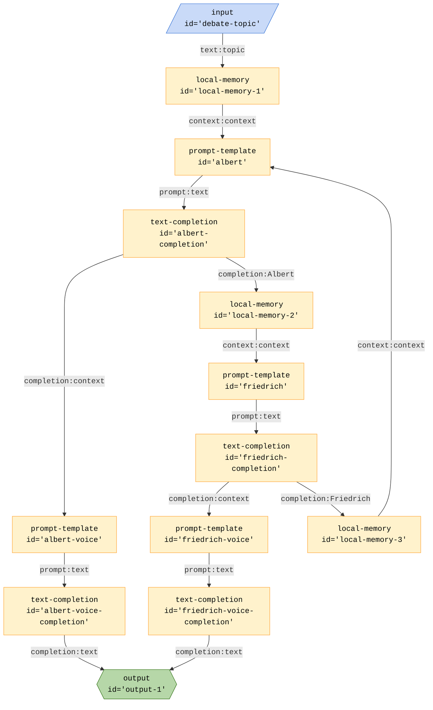

# endless-debate-with-voice
---

```mermaid
%%{init: {'themeVariables': { 'fontFamily': 'Fira Code, monospace' }}}%%
graph TD;
debate-topic[/"input
id='debate-topic'"/]:::input -- text:topic --> local-memory-1["local-memory
id='local-memory-1'"]
local-memory-1["local-memory
id='local-memory-1'"] -- context:context --> albert["prompt-template
id='albert'"]
albert["prompt-template
id='albert'"] -- prompt:text --> albert-completion["text-completion
id='albert-completion'"]
albert-completion["text-completion
id='albert-completion'"] -- completion:context --> albert-voice["prompt-template
id='albert-voice'"]
albert-voice["prompt-template
id='albert-voice'"] -- prompt:text --> albert-voice-completion["text-completion
id='albert-voice-completion'"]
albert-voice-completion["text-completion
id='albert-voice-completion'"] -- completion:text --> output-1{{"output
id='output-1'"}}:::output
albert-completion["text-completion
id='albert-completion'"] -- completion:Albert --> local-memory-2["local-memory
id='local-memory-2'"]
local-memory-2["local-memory
id='local-memory-2'"] -- context:context --> friedrich["prompt-template
id='friedrich'"]
friedrich["prompt-template
id='friedrich'"] -- prompt:text --> friedrich-completion["text-completion
id='friedrich-completion'"]
friedrich-completion["text-completion
id='friedrich-completion'"] -- completion:context --> friedrich-voice["prompt-template
id='friedrich-voice'"]
friedrich-voice["prompt-template
id='friedrich-voice'"] -- prompt:text --> friedrich-voice-completion["text-completion
id='friedrich-voice-completion'"]
friedrich-voice-completion["text-completion
id='friedrich-voice-completion'"] -- completion:text --> output-1{{"output
id='output-1'"}}:::output
friedrich-completion["text-completion
id='friedrich-completion'"] -- completion:Friedrich --> local-memory-3["local-memory
id='local-memory-3'"]
local-memory-3["local-memory
id='local-memory-3'"] -- context:context --> albert["prompt-template
id='albert'"]
classDef default stroke:#ffab40,fill:#fff2ccff,color:#000
classDef input stroke:#3c78d8,fill:#c9daf8ff,color:#000
classDef output stroke:#38761d,fill:#b6d7a8ff,color:#000
classDef passthrough stroke:#a64d79,fill:#ead1dcff,color:#000
classDef slot stroke:#a64d79,fill:#ead1dcff,color:#000
classDef slotted stroke:#a64d79
```