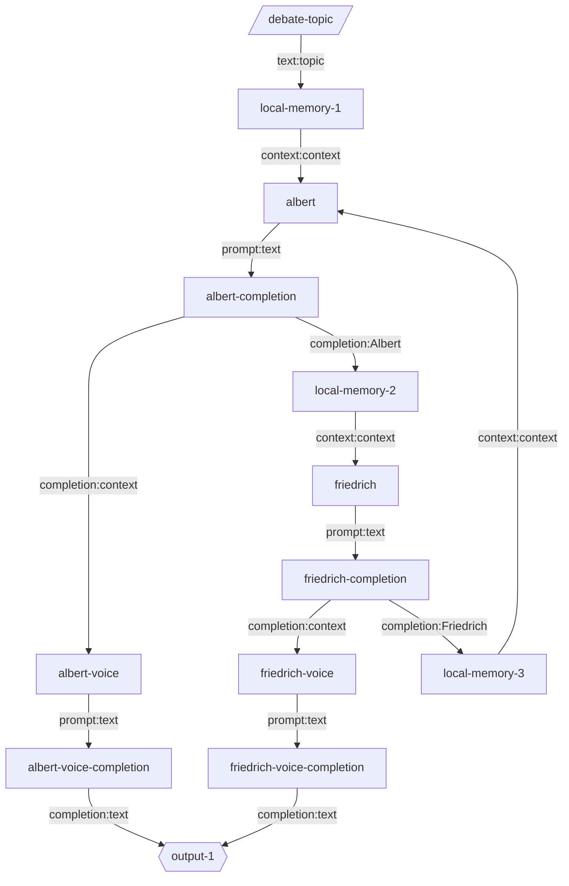

# endless-debate-with-voice
---

```mermaid
graph TD;
debate-topic[/debate-topic/] -- text:topic --> local-memory-1
local-memory-1 -- context:context --> albert
albert -- prompt:text --> albert-completion
albert-completion -- completion:context --> albert-voice
albert-voice -- prompt:text --> albert-voice-completion
albert-voice-completion -- completion:text --> output-1{{output-1}}
albert-completion -- completion:Albert --> local-memory-2
local-memory-2 -- context:context --> friedrich
friedrich -- prompt:text --> friedrich-completion
friedrich-completion -- completion:context --> friedrich-voice
friedrich-voice -- prompt:text --> friedrich-voice-completion
friedrich-voice-completion -- completion:text --> output-1{{output-1}}
friedrich-completion -- completion:Friedrich --> local-memory-3
local-memory-3 -- context:context --> albert
```