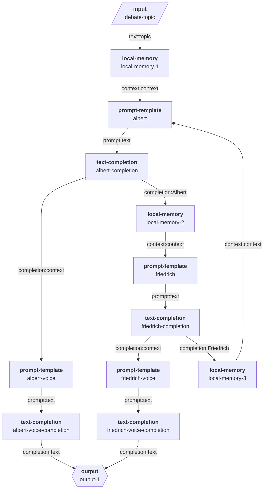

# endless-debate-with-voice
---

```mermaid
graph TD;
debate-topic[/"`**input**
debate-topic`"/]:::input -- text:topic --> local-memory-1["`**local-memory**
local-memory-1`"]
local-memory-1["`**local-memory**
local-memory-1`"] -- context:context --> albert["`**prompt-template**
albert`"]
albert["`**prompt-template**
albert`"] -- prompt:text --> albert-completion["`**text-completion**
albert-completion`"]
albert-completion["`**text-completion**
albert-completion`"] -- completion:context --> albert-voice["`**prompt-template**
albert-voice`"]
albert-voice["`**prompt-template**
albert-voice`"] -- prompt:text --> albert-voice-completion["`**text-completion**
albert-voice-completion`"]
albert-voice-completion["`**text-completion**
albert-voice-completion`"] -- completion:text --> output-1{{"`**output**
output-1`"}}:::output
albert-completion["`**text-completion**
albert-completion`"] -- completion:Albert --> local-memory-2["`**local-memory**
local-memory-2`"]
local-memory-2["`**local-memory**
local-memory-2`"] -- context:context --> friedrich["`**prompt-template**
friedrich`"]
friedrich["`**prompt-template**
friedrich`"] -- prompt:text --> friedrich-completion["`**text-completion**
friedrich-completion`"]
friedrich-completion["`**text-completion**
friedrich-completion`"] -- completion:context --> friedrich-voice["`**prompt-template**
friedrich-voice`"]
friedrich-voice["`**prompt-template**
friedrich-voice`"] -- prompt:text --> friedrich-voice-completion["`**text-completion**
friedrich-voice-completion`"]
friedrich-voice-completion["`**text-completion**
friedrich-voice-completion`"] -- completion:text --> output-1{{"`**output**
output-1`"}}:::output
friedrich-completion["`**text-completion**
friedrich-completion`"] -- completion:Friedrich --> local-memory-3["`**local-memory**
local-memory-3`"]
local-memory-3["`**local-memory**
local-memory-3`"] -- context:context --> albert["`**prompt-template**
albert`"]
```