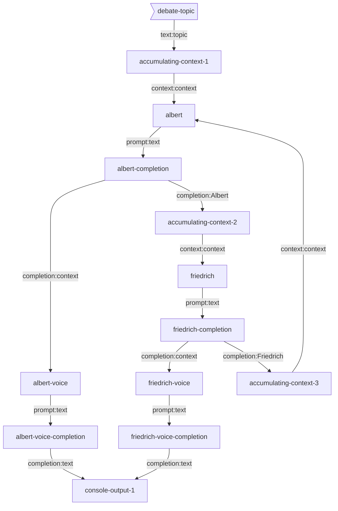

# endless-debate-with-voice
---

```mermaid
graph TD;
debate-topic>debate-topic] -- text:topic --> accumulating-context-1
accumulating-context-1 -- context:context --> albert
albert -- prompt:text --> albert-completion
albert-completion -- completion:context --> albert-voice
albert-voice -- prompt:text --> albert-voice-completion
albert-voice-completion -- completion:text --> console-output-1
albert-completion -- completion:Albert --> accumulating-context-2
accumulating-context-2 -- context:context --> friedrich
friedrich -- prompt:text --> friedrich-completion
friedrich-completion -- completion:context --> friedrich-voice
friedrich-voice -- prompt:text --> friedrich-voice-completion
friedrich-voice-completion -- completion:text --> console-output-1
friedrich-completion -- completion:Friedrich --> accumulating-context-3
accumulating-context-3 -- context:context --> albert
```