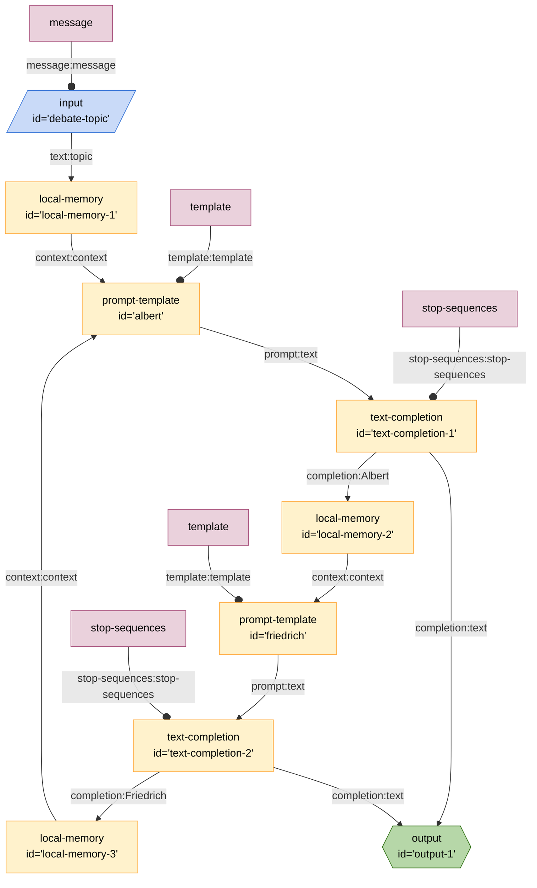

# endless-debate
---

```mermaid
%%{init: 'themeVariables': { 'fontFamily': 'Fira Code, monospace' }}%%
graph TD;
debatetopic[/"input
id='debate-topic'"/]:::input -- text:topic --> localmemory1["local-memory
id='local-memory-1'"]
localmemory1["local-memory
id='local-memory-1'"] -- context:context --> albert["prompt-template
id='albert'"]
albert["prompt-template
id='albert'"] -- prompt:text --> textcompletion1["text-completion
id='text-completion-1'"]
textcompletion1["text-completion
id='text-completion-1'"] -- completion:text --> output1{{"output
id='output-1'"}}:::output
textcompletion1["text-completion
id='text-completion-1'"] -- completion:Albert --> localmemory2["local-memory
id='local-memory-2'"]
localmemory2["local-memory
id='local-memory-2'"] -- context:context --> friedrich["prompt-template
id='friedrich'"]
friedrich["prompt-template
id='friedrich'"] -- prompt:text --> textcompletion2["text-completion
id='text-completion-2'"]
textcompletion2["text-completion
id='text-completion-2'"] -- completion:text --> output1{{"output
id='output-1'"}}:::output
textcompletion2["text-completion
id='text-completion-2'"] -- completion:Friedrich --> localmemory3["local-memory
id='local-memory-3'"]
localmemory3["local-memory
id='local-memory-3'"] -- context:context --> albert["prompt-template
id='albert'"]
messagedebatetopic[message]:::config -- message:message --o debatetopic
stopsequencestextcompletion1[stop-sequences]:::config -- stop-sequences:stop-sequences --o textcompletion1
stopsequencestextcompletion2[stop-sequences]:::config -- stop-sequences:stop-sequences --o textcompletion2
templatealbert[template]:::config -- template:template --o albert
templatefriedrich[template]:::config -- template:template --o friedrich
classDef default stroke:#ffab40,fill:#fff2ccff,color:#000
classDef input stroke:#3c78d8,fill:#c9daf8ff,color:#000
classDef output stroke:#38761d,fill:#b6d7a8ff,color:#000
classDef passthrough stroke:#a64d79,fill:#ead1dcff,color:#000
classDef slot stroke:#a64d79,fill:#ead1dcff,color:#000
classDef config stroke:#a64d79,fill:#ead1dcff,color:#000
classDef slotted stroke:#a64d79
```