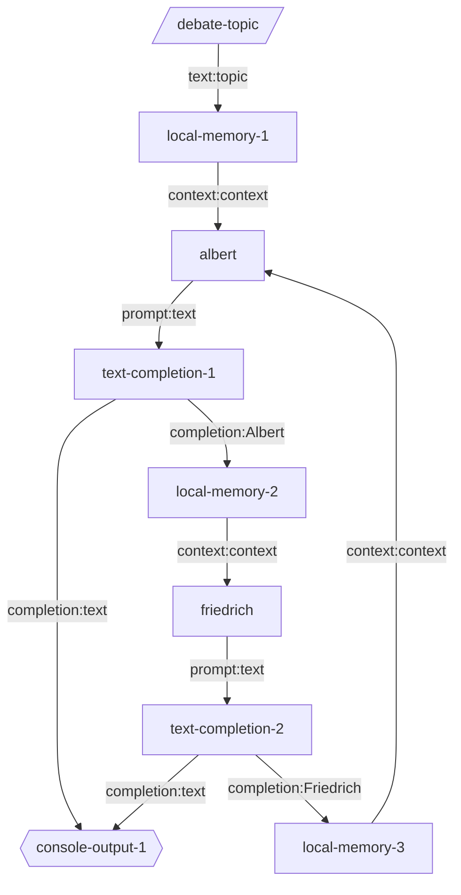

# endless-debate
---

```mermaid
graph TD;
debate-topic[/debate-topic/] -- text:topic --> local-memory-1
local-memory-1 -- context:context --> albert
albert -- prompt:text --> text-completion-1
text-completion-1 -- completion:text --> console-output-1{{console-output-1}}
text-completion-1 -- completion:Albert --> local-memory-2
local-memory-2 -- context:context --> friedrich
friedrich -- prompt:text --> text-completion-2
text-completion-2 -- completion:text --> console-output-1{{console-output-1}}
text-completion-2 -- completion:Friedrich --> local-memory-3
local-memory-3 -- context:context --> albert
```