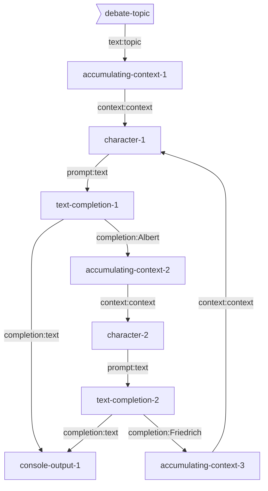

# endless-debate
---

```mermaid
graph TD;
debate-topic>debate-topic] -- text:topic --> accumulating-context-1
accumulating-context-1 -- context:context --> character-1
character-1 -- prompt:text --> text-completion-1
text-completion-1 -- completion:text --> console-output-1
text-completion-1 -- completion:Albert --> accumulating-context-2
accumulating-context-2 -- context:context --> character-2
character-2 -- prompt:text --> text-completion-2
text-completion-2 -- completion:text --> console-output-1
text-completion-2 -- completion:Friedrich --> accumulating-context-3
accumulating-context-3 -- context:context --> character-1
```