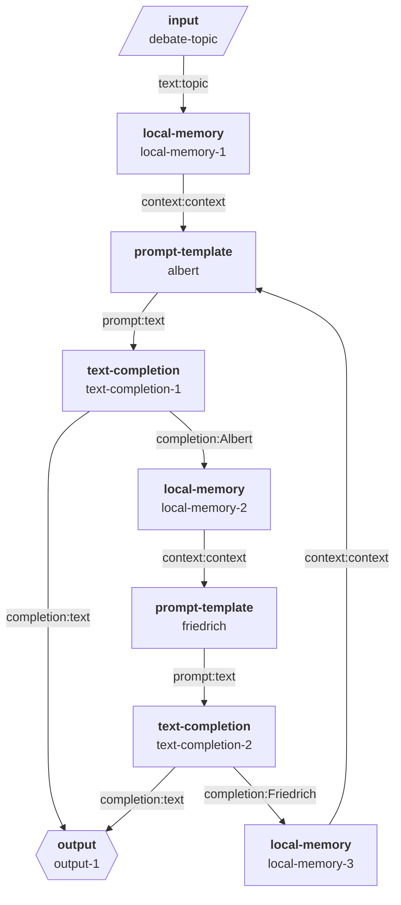

# endless-debate
---

```mermaid
graph TD;
debate-topic[/"`**input**
debate-topic`"/]:::input -- text:topic --> local-memory-1["`**local-memory**
local-memory-1`"]
local-memory-1["`**local-memory**
local-memory-1`"] -- context:context --> albert["`**prompt-template**
albert`"]
albert["`**prompt-template**
albert`"] -- prompt:text --> text-completion-1["`**text-completion**
text-completion-1`"]
text-completion-1["`**text-completion**
text-completion-1`"] -- completion:text --> output-1{{"`**output**
output-1`"}}:::output
text-completion-1["`**text-completion**
text-completion-1`"] -- completion:Albert --> local-memory-2["`**local-memory**
local-memory-2`"]
local-memory-2["`**local-memory**
local-memory-2`"] -- context:context --> friedrich["`**prompt-template**
friedrich`"]
friedrich["`**prompt-template**
friedrich`"] -- prompt:text --> text-completion-2["`**text-completion**
text-completion-2`"]
text-completion-2["`**text-completion**
text-completion-2`"] -- completion:text --> output-1{{"`**output**
output-1`"}}:::output
text-completion-2["`**text-completion**
text-completion-2`"] -- completion:Friedrich --> local-memory-3["`**local-memory**
local-memory-3`"]
local-memory-3["`**local-memory**
local-memory-3`"] -- context:context --> albert["`**prompt-template**
albert`"]
```