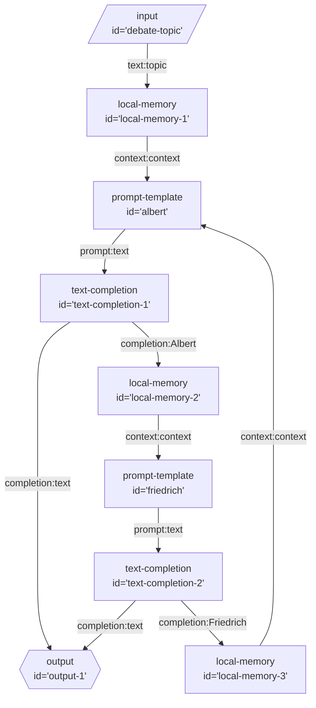

# endless-debate
---

```mermaid
graph TD;
debate-topic[/"input
id='debate-topic'"/]:::input -- text:topic --> local-memory-1["local-memory
id='local-memory-1'"]
local-memory-1["local-memory
id='local-memory-1'"] -- context:context --> albert["prompt-template
id='albert'"]
albert["prompt-template
id='albert'"] -- prompt:text --> text-completion-1["text-completion
id='text-completion-1'"]
text-completion-1["text-completion
id='text-completion-1'"] -- completion:text --> output-1{{"output
id='output-1'"}}:::output
text-completion-1["text-completion
id='text-completion-1'"] -- completion:Albert --> local-memory-2["local-memory
id='local-memory-2'"]
local-memory-2["local-memory
id='local-memory-2'"] -- context:context --> friedrich["prompt-template
id='friedrich'"]
friedrich["prompt-template
id='friedrich'"] -- prompt:text --> text-completion-2["text-completion
id='text-completion-2'"]
text-completion-2["text-completion
id='text-completion-2'"] -- completion:text --> output-1{{"output
id='output-1'"}}:::output
text-completion-2["text-completion
id='text-completion-2'"] -- completion:Friedrich --> local-memory-3["local-memory
id='local-memory-3'"]
local-memory-3["local-memory
id='local-memory-3'"] -- context:context --> albert["prompt-template
id='albert'"]
```