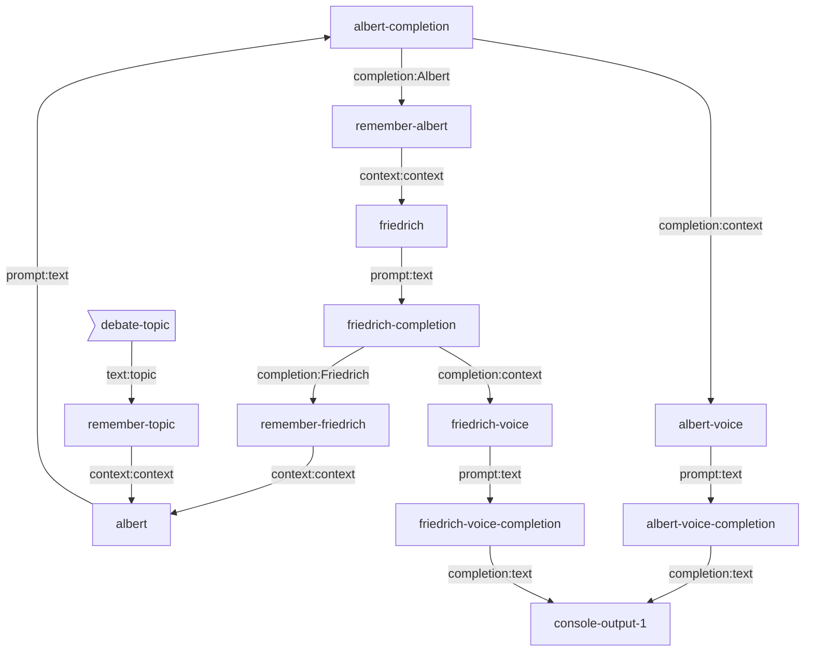

# imperative-test
---

```mermaid
graph TD;
albert-voice-completion -- completion:text --> console-output-1
albert-voice -- prompt:text --> albert-voice-completion
albert-completion -- completion:context --> albert-voice
albert-completion -- completion:Albert --> remember-albert
albert -- prompt:text --> albert-completion
friedrich-voice-completion -- completion:text --> console-output-1
friedrich-voice -- prompt:text --> friedrich-voice-completion
friedrich-completion -- completion:context --> friedrich-voice
friedrich-completion -- completion:Friedrich --> remember-friedrich
friedrich -- prompt:text --> friedrich-completion
remember-friedrich -- context:context --> albert
remember-albert -- context:context --> friedrich
remember-topic -- context:context --> albert
debate-topic>debate-topic] -- text:topic --> remember-topic
```